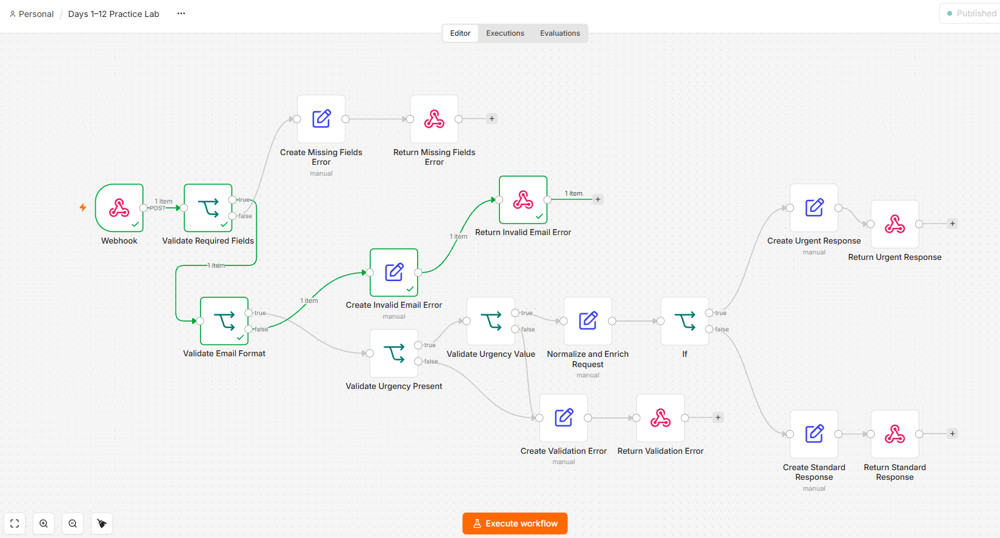
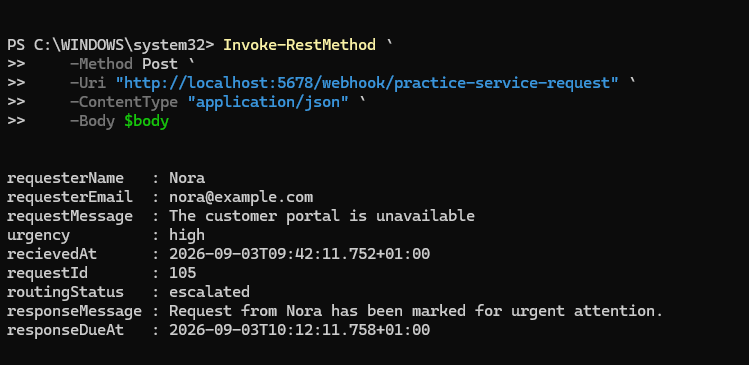
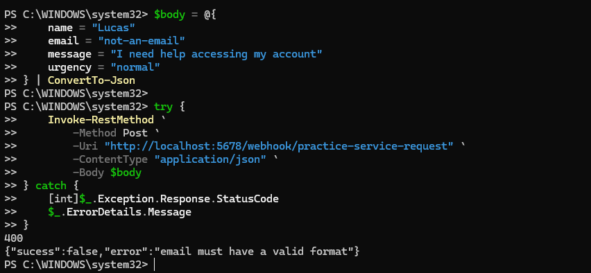

# Service Request API

An n8n webhook workflow that receives customer service requests, validates the submitted data, normalizes it, and routes the request according to its urgency.

## Features

- Accepts service requests through a POST webhook
- Checks that `name`, `email`, and `message` are present
- Validates the email format
- Validates and normalizes the urgency value
- Adds a request ID and received timestamp
- Routes high-urgency requests for urgent attention
- Routes normal requests to the standard queue
- Calculates a response deadline
- Returns validation errors with HTTP status `400`

## Request Body

```json
{
  "name": "Nora",
  "email": "nora@example.com",
  "message": "The customer portal is unavailable",
  "urgency": "high"
}
```

## Successful Urgent Response

```json
{
  "requesterName": "Nora",
  "requesterEmail": "nora@example.com",
  "requestMessage": "The customer portal is unavailable",
  "urgency": "high",
  "receivedAt": "2026-09-03T09:42:11.752+01:00",
  "requestId": "105",
  "routingStatus": "escalated",
  "responseMessage": "Request from Nora has been marked for urgent attention.",
  "responseDueAt": "2026-09-03T10:12:11.758+01:00"
}
```

## Validation Error Example

```json
{
  "success": false,
  "error": "email must have a valid format"
}
```

## Screenshots

### Workflow Overview



### Successful Production Response



### Validation Error Response



## Run the Workflow

1. Import `workflow.json` into n8n.
2. Review the webhook and response nodes.
3. Publish the workflow.
4. Send a POST request to:

```text
http://localhost:5678/webhook/practice-service-request
```

The production URL works while the local n8n instance is running and the workflow is published.

## Example PowerShell Request

```powershell
$body = @{
    name = "Nora"
    email = "nora@example.com"
    message = "The customer portal is unavailable"
    urgency = "high"
} | ConvertTo-Json

Invoke-RestMethod `
    -Method Post `
    -Uri "http://localhost:5678/webhook/practice-service-request" `
    -ContentType "application/json" `
    -Body $body
```

## Skills Demonstrated

- Webhooks and HTTP requests
- JSON data handling
- Field mapping and expressions
- Input validation
- Conditional routing
- Date and time expressions
- Error responses and HTTP status codes
- Testing with PowerShell
- Reviewing n8n execution history
- Git and GitHub portfolio packaging
