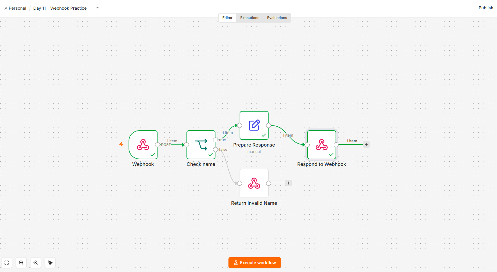

# Day 11 — Webhook Practice

An n8n workflow that receives a name through a POST request, validates it, and returns either a greeting or an error.

## Workflow

Webhook → Check Name

- **True:** Prepare Response → Respond to Webhook
- **False:** Return Invalid Name

## Validation

The name must be text containing at least one non-space character.

```javascript
{{ typeof $json.body?.name === 'string' && $json.body.name.trim().length > 0 }}
```

Valid requests receive a greeting. Invalid requests receive HTTP 400 with an explanatory message.

## Setup

1. Import `day-11-webhook-practice.json` into a blank n8n workflow.
2. Confirm the Webhook settings:
   - HTTP Method: POST
   - Path: `day-11-practice`
   - Respond: Using 'Respond to Webhook' Node
3. Click **Execute workflow** on the canvas.
4. Send a request while the workflow is listening.

These commands assume n8n is running locally on port 5678. Start a new test execution before each request.

## Test 1 — Valid name

Run in PowerShell:

```powershell
Invoke-RestMethod -Method Post -Uri "http://localhost:5678/webhook-test/day-11-practice" -ContentType "application/json" -Body '{"name":"Fabio"}'
```

Expected response:

```json
{
  "name": "Fabio",
  "message": "Hello, Fabio! Your request was received."
}
```

Result: tested successfully after adding validation.

## Test 2 — Missing name

Run in PowerShell:

```powershell
Invoke-RestMethod -Method Post -Uri "http://localhost:5678/webhook-test/day-11-practice" -ContentType "application/json" -Body '{}'
```

Expected response: HTTP 400.

```json
{
  "error": "Please provide a non-empty name as text."
}
```

Result: the error message was returned. PowerShell displays error responses in red.

## Troubleshooting

During initial testing, only the Webhook node executed and the caller received no greeting. Starting the whole workflow with **Execute workflow**, then resending the request, allowed all connected nodes to run.

Before validation was added, an empty request produced “Hello, undefined!” The Check Name node now routes missing names to an error response.

## Scope and security

This is a local learning exercise using fictional test input and no authentication. It is not intended for public deployment without authentication and additional security controls.

Missing-name and valid-name cases were tested. The validation also checks for empty strings, spaces-only strings, and non-text values; those additional cases have not yet been tested.
## Workflow screenshot

