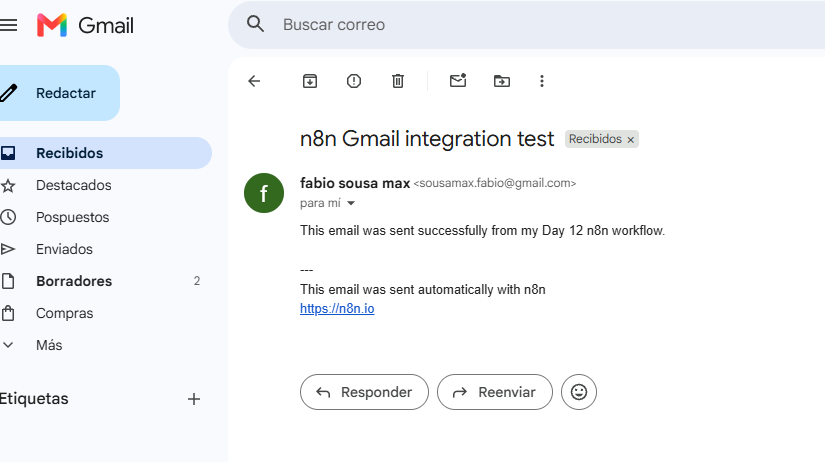
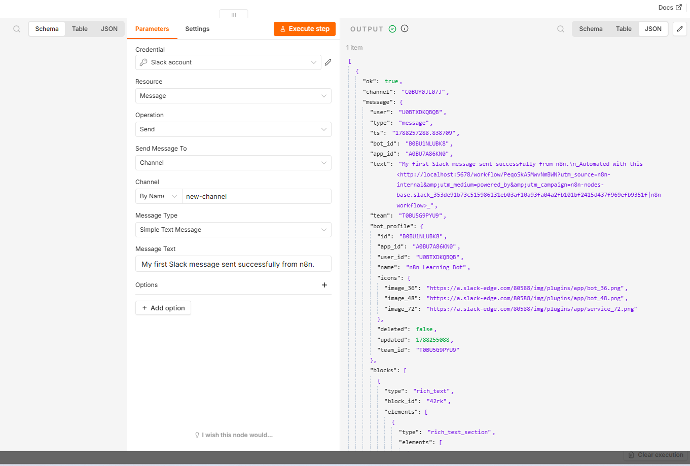
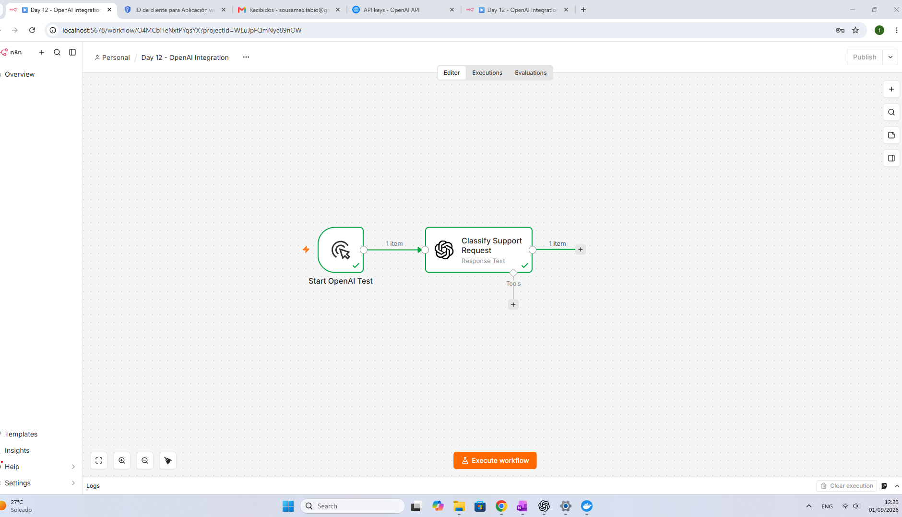
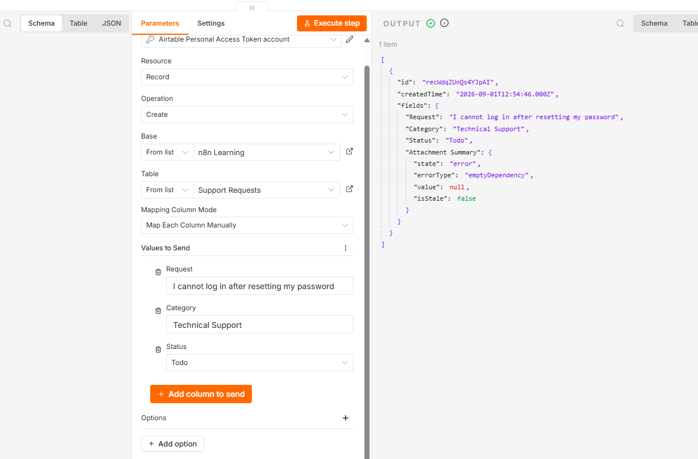

# Day 12 — Essential n8n Integrations

Four small n8n workflows demonstrating authenticated integrations with Gmail, Slack, OpenAI, and Airtable.

## Integrations completed

### Gmail

**Workflow:** Manual Trigger → Prepare Email Data → Send a Message

- Enabled the Gmail API in Google Cloud.
- Configured OAuth2 for the local n8n callback URL.
- Mapped recipient, subject, and message data into the Gmail node.
- Sent and received a test email successfully.

### Slack

**Workflow:** Manual Trigger → Send a Message

- Created a Slack workspace and a custom bot app.
- Granted the bot `channels:read` and `chat:write` scopes.
- Installed the app in the workspace and added it to the target channel.
- Sent a test message to `#new-channel` successfully.

### OpenAI

**Workflow:** Manual Trigger → Message a Model

- Created a separate OpenAI API credential for n8n.
- Used `GPT-5.6-LUNA` to classify a sample customer-support request.
- Prompted the model to return one category only.
- Received `Technical Support` for the password-reset login example.

Sample prompt:

```text
Classify this customer request into one category: Billing, Technical Support,
Sales, or Other. Return only the category. Request: I cannot log in to my
account after resetting my password.
```

### Airtable

**Workflow:** Manual Trigger → Create Support Record

- Created the `n8n Learning` base and `Support Requests` table.
- Connected n8n with a Personal Access Token limited to that base.
- Granted only `data.records:read`, `data.records:write`, and `schema.bases:read`.
- Created a record containing a request, category, and status.

## Tests completed

- Confirmed delivery of the Gmail message in the destination inbox.
- Confirmed Slack returned a successful message response for `#new-channel`.
- Confirmed OpenAI returned the expected classification.
- Confirmed Airtable created a record with `Technical Support` and `Todo`.

## Workflow exports

- [Gmail integration](day-12-gmail-integration.json)
- [Slack integration](day-12-slack-integration.json)
- [OpenAI integration](day-12-openai-integration.json)
- [Airtable integration](day-12-airtable-integration.json)

The exports contain workflow structure and credential names, but not the stored credential secrets. Importing them into another n8n installation requires creating or selecting new credentials.

## Security and cost notes

- Credentials and access tokens are stored in n8n and are not included in this repository.
- Screenshots were checked to ensure that they do not expose API keys or access tokens.
- Slack permissions were limited to reading public channel information and sending messages.
- Airtable access was limited to one base and three required scopes.
- OpenAI API usage is billed separately from a ChatGPT subscription.

## Current limitations

- These are isolated learning workflows using manual triggers and fixed test data.
- They do not yet include retries, error routes, validation, or duplicate prevention.
- The next lesson adds reliability and error-handling patterns.

## Evidence

### Gmail delivery



### Slack execution



### OpenAI execution



### Airtable execution



## Reusing the workflows

Import the required JSON file into n8n, create fresh credentials in your own installation, select your own accounts and destinations, and run the workflow manually before adding automatic triggers. Never place access tokens or API keys directly in an exported workflow file.
