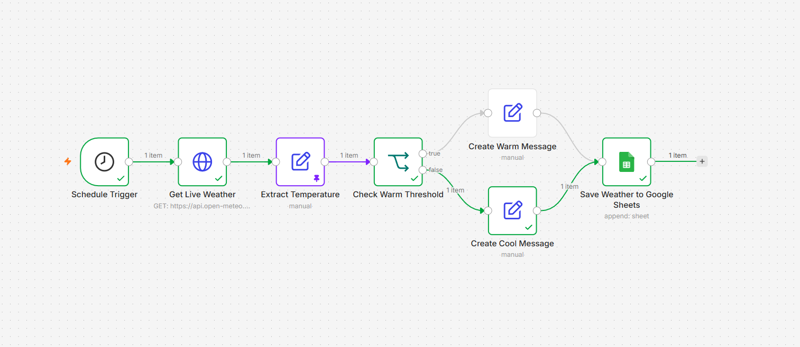
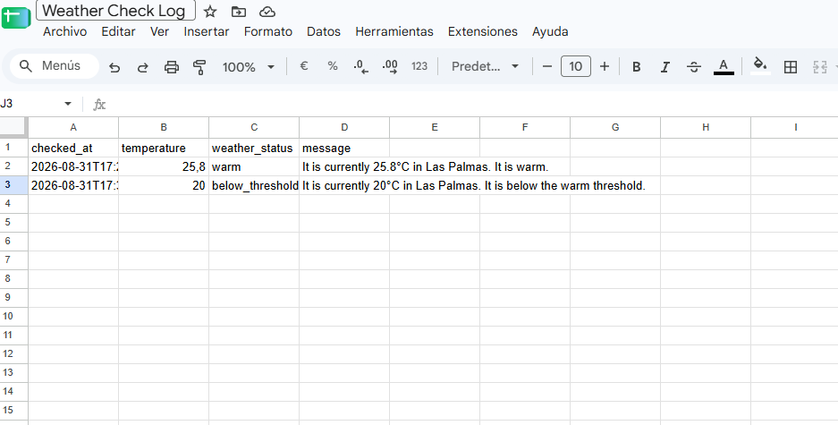

# Day 12 — Scheduled Weather Check

An n8n workflow that retrieves weather data for Las Palmas, checks the temperature, and appends the result to Google Sheets.

## Workflow

Schedule Trigger → Get Live Weather → Extract Temperature → Check Warm Threshold

- **Temperature ≥ 25°C:** Create Warm Message → Save Weather to Google Sheets
- **Temperature < 25°C:** Create Cool Message → Save Weather to Google Sheets

Both branches use the same Google Sheets node.

## Schedule

- Daily at 09:00
- Workflow timezone: Atlantic/Canary
- Left unpublished after testing

Automatic scheduling requires publishing the workflow and keeping the computer awake with the n8n container running.

## Google Sheets output

The spreadsheet uses these headings in its first row:

```text
checked_at	temperature	weather_status	message
```

Values are mapped using:

- `checked_at`: `{{ $now.toISO() }}`
- `temperature`: `{{ $json.temperature }}`
- `weather_status`: `{{ $json.weather_status }}`
- `message`: `{{ $json.message }}`

Each execution appends a new row.

## Tests completed

- Executed the weather workflow manually.
- Temporarily published a one-minute schedule.
- Confirmed automatic executions one minute apart.
- Unpublished the workflow and restored the daily 09:00 schedule.
- Connected Google Sheets using custom OAuth2 credentials.
- Saved a live weather result through the warm branch.
- Pinned a test temperature of 20°C and confirmed the cool branch saved a row.
- Removed pinned data after testing.

The 20°C row is synthetic test data, not an observed weather reading. Automatic scheduling was tested before adding Google Sheets; spreadsheet writes were tested manually.

## Setup

1. Import `day-12-scheduled-weather-check.json` into n8n.
2. Create a spreadsheet with the four headings above.
3. Configure your own Google Sheets OAuth2 credential.
4. In Save Weather to Google Sheets, replace the document URL and sheet tab name with your own.
5. Confirm the timezone and schedule.
6. Ensure no data is pinned.
7. Execute manually and check the new spreadsheet row.
8. Publish only when ready for automatic runs.

## Security and limitations

- Keep OAuth client secrets and tokens out of GitHub.
- An imported workflow requires a working credential connection; the workflow export is not a credential backup.
- The Google permission used allows access to all spreadsheets in the connected account, not just this weather log.
- The spreadsheet is selected by URL; Drive browsing permissions were not granted during this exercise.
- Repeated executions append additional rows. Duplicate prevention and retries have not been added.
- Google OAuth testing mode may require periodic reconnection.

## Screenshots

### Workflow


### Saved results
