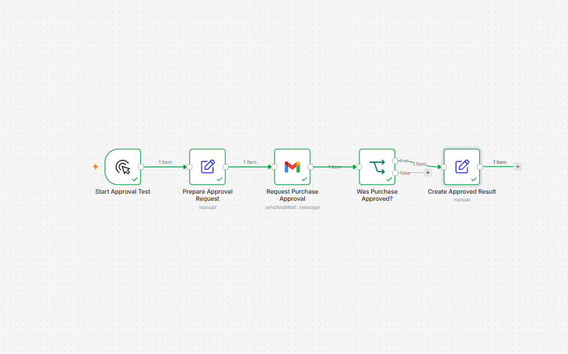
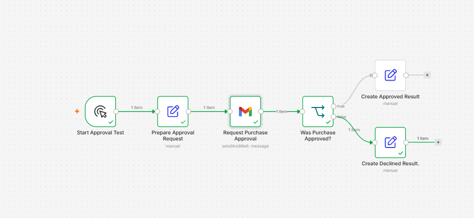

# Human Approval Workflow

An n8n workflow that sends a purchase-approval request by email, pauses while waiting for a human decision, and routes the result according to whether the request was approved or declined.

## Workflow

```text
Start Approval Test
→ Prepare Approval Request
→ Request Purchase Approval
→ Was Purchase Approved?
   ├─ true  → Create Approved Result
   └─ false → Create Declined Result
```

## How It Works

1. A Manual Trigger starts the test.
2. Edit Fields creates a sample purchase request.
3. Gmail sends an approval email and waits for a response.
4. The recipient selects Approve or Decline.
5. Gmail returns an `approved` Boolean and a response timestamp.
6. An IF node routes the execution through the correct branch.
7. The final Edit Fields node creates a clear result.

## Approval Request Data

The sample request contains:

```json
{
  "requestTitle": "Software purchase",
  "requestedBy": "Fabio"
}
```

## Approved Result

```json
{
  "requestTitle": "Software purchase",
  "requestedBy": "Fabio",
  "approvalStatus": "approved",
  "respondedAt": "generated when the recipient responds",
  "resultMessage": "Purchase request approved: Software purchase"
}
```

## Declined Result

```json
{
  "requestTitle": "Software purchase",
  "requestedBy": "Fabio",
  "approvalStatus": "declined",
  "respondedAt": "generated when the recipient responds",
  "resultMessage": "Purchase request declined: Software purchase"
}
```

## Screenshots

### Approved Route



### Declined Route



## Reusing the Workflow

1. Import [`workflow.json`](workflow.json) into n8n.
2. Create or select a Gmail OAuth2 credential.
3. Open `Request Purchase Approval`.
4. Replace the recipient with an email address you control.
5. Confirm that the approval type is set to **Approve and Disapprove**.
6. Execute the workflow manually.
7. Open the email and select one of the two responses.
8. Return to n8n and review the routed result.

## Security and Privacy

- Gmail credentials are stored in n8n and are not included in the exported workflow.
- Replace personal email addresses before sharing screenshots or sample data.
- Never commit OAuth client secrets or access tokens to GitHub.
- The workflow export contains credential references, not stored credential secrets.

## Current Limitations

- The workflow uses a Manual Trigger and fixed test data.
- It does not yet store approval decisions in a database or spreadsheet.
- It does not notify the requester after the decision.
- It does not include an approval timeout or escalation route.
- A locally hosted approval link may only be accessible from the machine running n8n unless a public n8n URL is configured.

## Skills Demonstrated

- Gmail integration with OAuth2
- Send-and-wait workflow execution
- Human approval steps
- Dynamic expressions
- Boolean values
- IF-based routing
- Approved and declined branches
- Clear workflow naming
- Secure workflow export practices