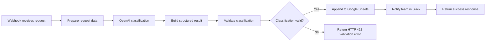
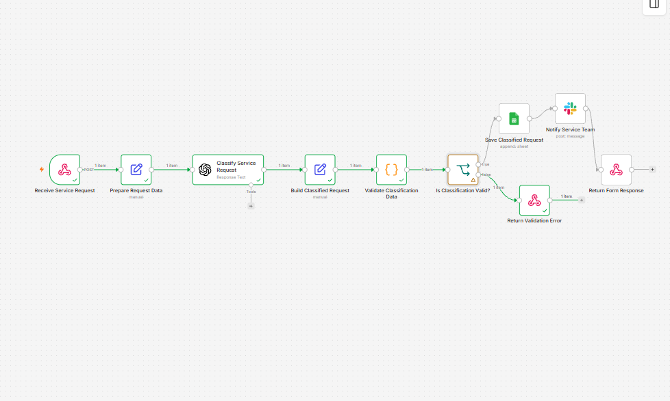
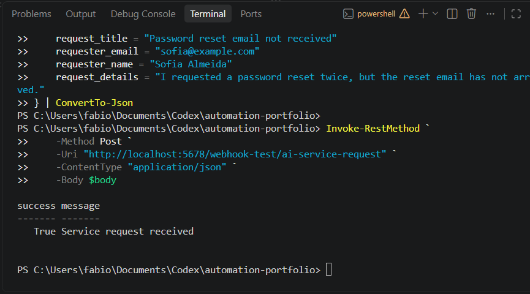
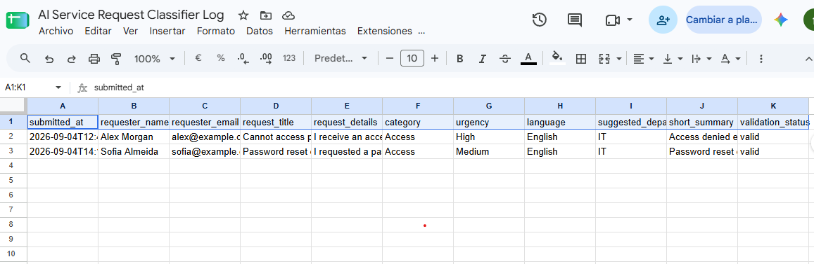
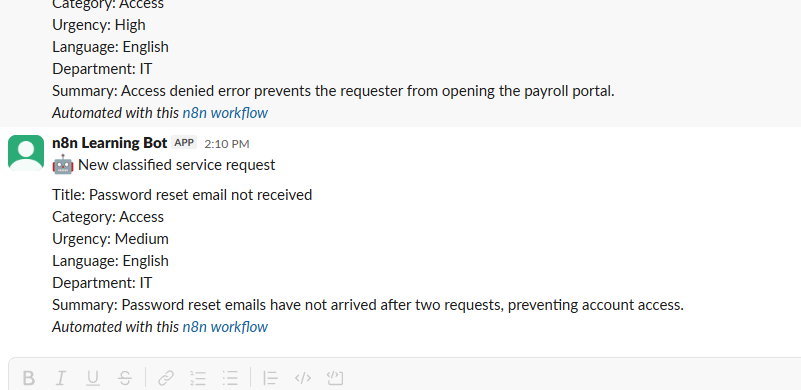
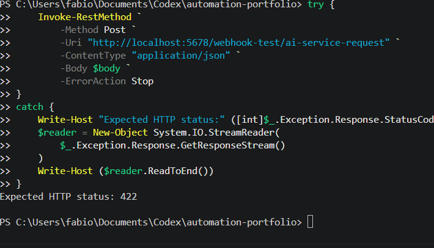

# AI Service Request Classifier

An n8n workflow that receives internal service requests, uses OpenAI to classify them, validates the classification, saves valid requests to Google Sheets, and notifies a service team through Slack.

## Business purpose

Manually reviewing and routing service requests is repetitive and can delay support. This workflow creates a consistent intake process by automatically identifying:

- Category
- Urgency
- Language
- Suggested department
- Short summary

Valid requests are logged and sent to the appropriate service team. Invalid classifications return a controlled error response for manual review.

## Workflow architecture



## Workflow steps

1. **Receive Service Request** accepts a JSON request through an HTTP POST Webhook.
2. **Prepare Request Data** maps and standardises the submitted fields.
3. **Classify Service Request** asks OpenAI to return structured classification data.
4. **Build Classified Request** combines the original request with the AI result.
5. **Validate Classification Data** checks required fields and permitted values.
6. **Is Classification Valid?** routes the item through the valid or invalid path.
7. Valid requests are appended to **Google Sheets**.
8. **Slack** receives a formatted service-team notification.
9. The Webhook returns either a success response or an HTTP `422` validation error.

## Example request

```json
{
  "request_title": "Password reset email not received",
  "requester_email": "sofia@example.com",
  "requester_name": "Sofia Almeida",
  "request_details": "I requested a password reset twice, but the reset email has not arrived."
}
```

All names and email addresses shown in this repository are fictional test data.

## Example classification

```json
{
  "category": "Access",
  "urgency": "Medium",
  "language": "English",
  "suggested_department": "IT",
  "short_summary": "Password reset emails have not arrived after two requests, preventing account access.",
  "validation_status": "valid"
}
```

## Validation and error handling

The workflow checks that the AI response contains all required fields and accepted classification values.

A valid classification continues to Google Sheets and Slack. An invalid classification follows a separate branch and returns:

```json
{
  "success": false,
  "message": "The classification was incomplete and requires manual review."
}
```

The invalid route uses HTTP status `422`, meaning that the request was understood but the processed data did not pass validation.

## Successful response

After the request has been classified, saved, and announced in Slack, the Webhook returns:

```json
{
  "success": true,
  "message": "Service request received"
}
```

## Tools and integrations

- n8n
- OpenAI
- Google Sheets
- Slack
- Webhooks and JSON
- PowerShell for API testing
- Git and GitHub

## Setup

1. Import `workflow.json` into n8n.
2. Select your own OpenAI credential in the OpenAI node.
3. Select your own Google Sheets credential and destination spreadsheet.
4. Select your own Slack credential and channel.
5. Open the Webhook node and copy its Test or Production URL.
6. Test the workflow with fictional JSON data.
7. Keep the workflow inactive until every route has been verified.

The exported workflow uses placeholders for external resource and credential-reference IDs. No working credentials are included.

## Security precautions

- No API keys, passwords, OAuth tokens, or private credentials are committed.
- External credential-reference IDs were replaced with placeholders.
- The private Google Sheet ID was replaced with a placeholder.
- Test identities are fictional.
- Real customer or employee information should not be used during portfolio testing.
- Production Webhooks should use appropriate authentication and access controls.

## Evidence

### Complete workflow



### Successful Webhook response



### Google Sheets result



### Slack notification



### Validation error response



## Skills demonstrated

- Designing an end-to-end automation
- Receiving and transforming JSON
- Structured AI classification
- Data mapping and expressions
- Output validation
- Conditional routing
- Google Sheets integration
- Slack integration
- Webhook success and failure responses
- HTTP status-code handling
- Secure portfolio documentation