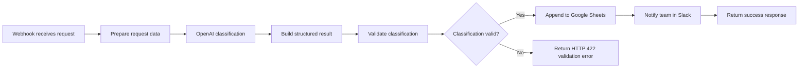

# AI Service Request Classifier

An n8n automation that receives service requests through a webhook, uses OpenAI to classify them, validates the AI output, stores valid requests in Google Sheets, and notifies the service team through Slack.

## What It Solves

Manually reviewing and routing incoming service requests is repetitive and can slow down response times.

This workflow automates the intake and classification process while validating AI output before it is accepted.

## Key Features

- HTTP POST webhook intake
- Structured JSON processing
- OpenAI-powered request classification
- Category, urgency, language, department, and summary extraction
- AI output validation
- Conditional routing
- Google Sheets storage
- Slack notifications
- Controlled HTTP success and validation-error responses

## Tech Stack

- n8n
- OpenAI
- Google Sheets
- Slack
- REST / HTTP
- Webhooks
- JSON
- Git and GitHub

## Workflow Architecture



## Request Flow

1. A client sends a service request to the n8n webhook.
2. The workflow normalises the request and records its submission time.
3. OpenAI returns a structured classification.
4. A Code node checks required fields, allowed values, email format, and summary length.
5. Valid requests are saved to Google Sheets and announced in Slack.
6. Invalid classifications receive an HTTP 422 response for manual review.

## Prerequisites

- A running n8n instance
- An OpenAI API credential configured in n8n
- A Google Sheets OAuth credential and a destination spreadsheet
- A Slack credential and a destination channel

The exported workflow contains credential placeholders only. It does not contain API keys or reusable authentication secrets.

## Setup

1. Download [`workflow.json`](workflow.json).
2. In n8n, select **Import from File** and choose the downloaded workflow.
3. Open the **Classify Service Request** node and select your OpenAI credential.
4. Open the **Save Classified Request** node, select your Google Sheets credential, and choose the destination spreadsheet.
5. Open the **Notify Service Team** node, select your Slack credential, and choose the destination channel.
6. Confirm that the Google Sheet contains columns matching the fields produced by **Build Classified Request**.
7. Save the workflow and run it in test mode.
8. When testing is complete, activate the workflow and use its production webhook URL.

## Sample Request

Send a POST request to the test or production webhook URL with a JSON body like this:

```json
{
  "requester_name": "Maria Silva",
  "requester_email": "maria@example.com",
  "request_title": "Unable to access booking system",
  "request_details": "Five employees receive an access denied message when signing in."
}
```

Example command:

```bash
curl -X POST "YOUR_N8N_WEBHOOK_URL" \
  -H "Content-Type: application/json" \
  -d '{"requester_name":"Maria Silva","requester_email":"maria@example.com","request_title":"Unable to access booking system","request_details":"Five employees receive an access denied message when signing in."}'
```

Successful response:

```json
{
  "success": true,
  "message": "Service request received"
}
```

Validation failure response (`422`):

```json
{
  "success": false,
  "message": "The classification was incomplete and requires manual review."
}
```

## Validation and Error Handling

The workflow checks that every required value is present and that:

- the requester email has a valid format;
- category is one of the supported service categories;
- urgency is `Low`, `Medium`, `High`, or `Critical`;
- the suggested department is recognised;
- the generated summary is no longer than 160 characters.

Invalid AI output is not written to Google Sheets or sent to Slack. It is routed to a controlled HTTP 422 response so it can be reviewed instead of silently entering downstream systems. Operational failures such as unavailable external services remain visible in n8n's execution history for investigation.

## Security Precautions

- Keep API keys and OAuth credentials inside n8n's encrypted credential store.
- Never commit `.env` files, access tokens, or exported credentials.
- Restrict Google Sheets and Slack access to the minimum required permissions.
- Protect the production webhook with authentication or a gateway before using it with sensitive data.
- Avoid sending confidential or unnecessary personal information to the AI service.
- Review n8n execution-data retention before processing real customer requests.

## Screenshots

### Workflow overview


### Successful webhook response


### Validation error


### Google Sheets result


### Slack notification


## Troubleshooting

### The webhook does not respond

- Confirm that the workflow is listening in test mode or active for the production URL.
- Check that the request uses POST and sends `Content-Type: application/json`.
- Verify that the request body uses the exact field names shown in the sample request.

### The workflow returns HTTP 422

- Open the execution and inspect `validation_errors` from **Validate Classification Data**.
- Confirm that OpenAI returned all required fields using the permitted values.
- Confirm that `requester_email` is valid and `short_summary` is 160 characters or fewer.

### Google Sheets or Slack fails

- Reconnect the relevant n8n credential.
- Confirm access to the selected spreadsheet or channel.
- Check that spreadsheet column names match the workflow output.
- Review the failed node's error details in the n8n execution history.

## Repository Contents

```text
day-14-ai-service-request-classifier/
|-- README.md
|-- workflow.json
`-- screenshots/
    |-- google-sheets-result.png
    |-- slack-notification.png
    |-- successful-webhook-response.png
    |-- validation-error-422.png
    `-- workflow-overview.png
```

## What This Project Demonstrates

- Designing an API-style webhook workflow
- Integrating OpenAI with operational business systems
- Validating probabilistic AI output before downstream use
- Returning meaningful HTTP success and error responses
- Managing credentials without publishing secrets
- Producing support-oriented setup and troubleshooting documentation
