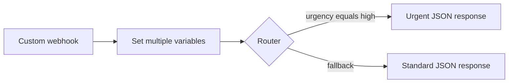
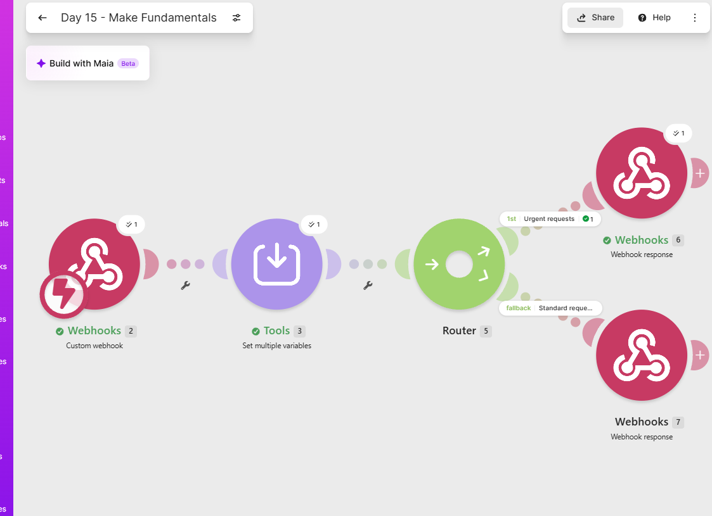
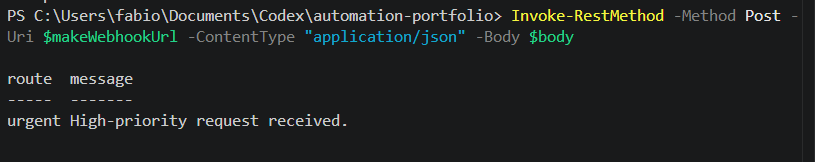
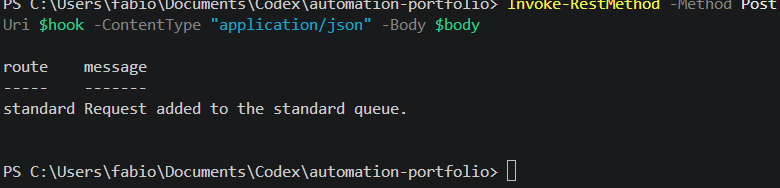

# Make Fundamentals: Service Request Router

A Make scenario that receives service requests through a custom webhook, maps the incoming data into reusable variables, and routes each request according to urgency.

## Business purpose

Service requests often need different handling based on priority. This scenario provides a simple intake layer that sends high-priority requests to an urgent route while all other requests follow a standard fallback route.

## Scenario architecture



## Scenario steps

1. **Custom webhook** receives a JSON service request.
2. **Set multiple variables** maps the requester's name, email, message, and urgency.
3. **Router** creates separate processing paths.
4. The **Urgent requests** filter accepts requests whose urgency equals `high`.
5. The **Standard requests** fallback catches all requests that do not match the urgent filter.
6. Each route returns a clear JSON response with HTTP status `200`.

## Example request

```json
{
  "name": "Maria",
  "email": "maria@example.com",
  "message": "The payment system has stopped working",
  "urgency": "high"
}
```

All identities and request details in this repository are fictional test data.

## Example urgent response

```json
{
  "route": "urgent",
  "message": "High-priority request received."
}
```

## Example standard response

```json
{
  "route": "standard",
  "message": "Request added to the standard queue."
}
```

## Make concepts demonstrated

- Scenarios and modules
- Bundles and data mapping
- Custom webhooks
- Variables
- Routers and filters
- Fallback routes
- Custom webhook responses
- Live API testing with PowerShell

## Setup

1. Import `blueprint.json` into Make.
2. Open the Custom webhook module and create a new webhook in your own Make account.
3. Send fictional sample JSON so Make detects the four input fields.
4. Confirm the variable mappings and route filter.
5. Test both urgent and standard requests with **Run once**.
6. Keep the scenario inactive until it is ready for controlled use.

The exported blueprint contains no working webhook URL, API key, password, or external credential.

## Security precautions

- Webhook URLs are treated as private trigger credentials.
- Webhook URLs shown during development were rotated and deleted.
- The final webhook URL is not stored in this repository.
- Only fictional test data is included.
- The scenario remains inactive when it is not being tested.

## Evidence

### Complete scenario



### Urgent route response



### Standard route response



## Skills demonstrated

- Designing a webhook-triggered automation
- Mapping structured JSON data
- Separating reusable values from incoming data
- Conditional routing with filters
- Using a fallback path
- Returning structured API responses
- Testing and troubleshooting queued versus live webhook requests
- Protecting and rotating webhook addresses
