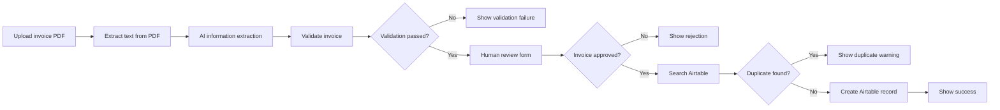
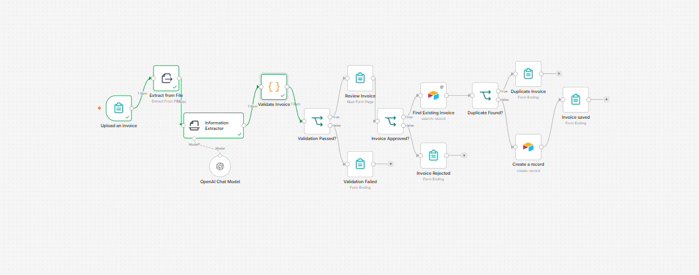
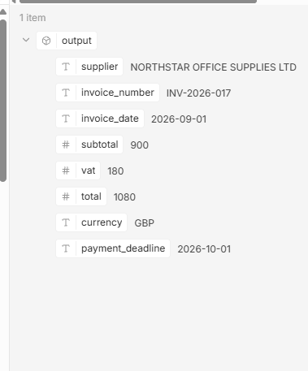
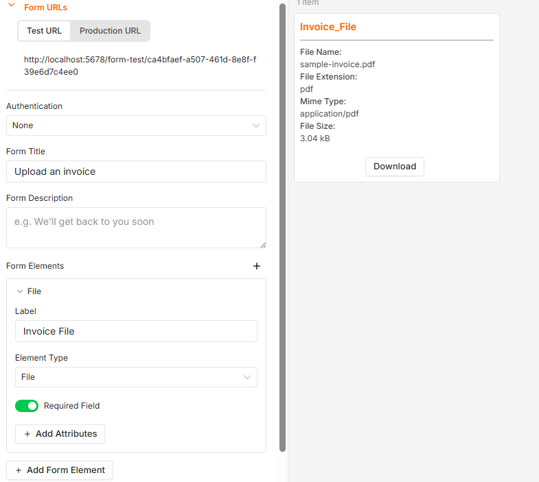
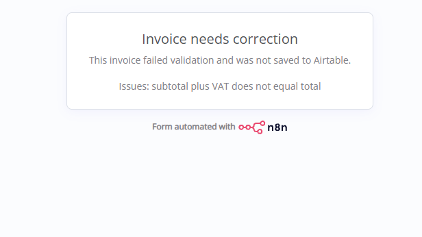
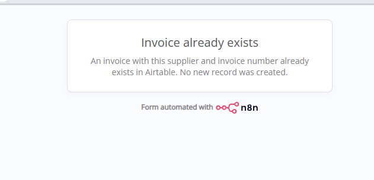
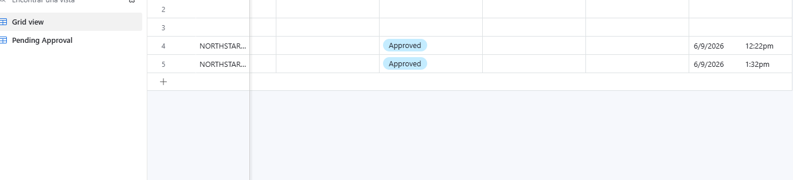

# Invoice Processing - Project 2, Part 1

An n8n workflow that receives an invoice PDF, extracts structured invoice data with OpenAI, validates the result, requests human approval, prevents duplicates, and saves approved invoices to Airtable.

## Business purpose

Entering supplier invoices manually is slow and error-prone. This workflow creates a controlled invoice-intake process with automated extraction and validation while keeping a person responsible for the final approval decision.

The workflow extracts:

- Supplier
- Invoice number
- Invoice date
- Subtotal
- VAT
- Total
- Currency
- Payment deadline

## Workflow architecture



## Workflow steps

1. **Upload an invoice** presents an n8n test form with a required PDF upload.
2. **Extract from File** reads the PDF and returns its text.
3. **Information Extractor** uses OpenAI to return the eight invoice fields as structured data.
4. **Validate Invoice** checks required values, dates, amounts, currency, payment deadline, and total arithmetic.
5. **Validation Passed?** sends invalid invoices to a controlled failure screen.
6. **Review Invoice** displays the extracted values and requires a human to choose Approve or Reject.
7. **Invoice Approved?** prevents rejected invoices from reaching Airtable.
8. **Find Existing Invoice** searches Airtable using supplier and invoice number.
9. **Duplicate Found?** prevents an existing invoice from being created again.
10. **Create a record** maps approved invoice values into Airtable.
11. Form-ending nodes show clear validation, rejection, duplicate, and success messages.

## Extraction schema

| Attribute | Type | Output rule |
|---|---|---|
| `supplier` | String | Supplier or vendor name as written |
| `invoice_number` | String | Preserve letters, separators, and leading zeros |
| `invoice_date` | String | `YYYY-MM-DD` |
| `subtotal` | Number | Numeric value without a currency symbol |
| `vat` | Number | Numeric value without a currency symbol |
| `total` | Number | Numeric value without a currency symbol |
| `currency` | String | Three-letter currency code |
| `payment_deadline` | String | `YYYY-MM-DD` |

The Information Extractor receives the text through:

```javascript
{{ $json.text }}
```

The OpenAI Chat Model uses `gpt-4o-mini`. The original `gpt-5-mini` selection required OpenAI organization verification, so the workflow was changed to a model available to the connected API account.

## Validation rules

The JavaScript validation step checks that:

- All eight required fields are present.
- Subtotal, VAT, and total are non-negative numbers.
- Dates use the `YYYY-MM-DD` format and represent real calendar dates.
- The payment deadline is not earlier than the invoice date.
- Subtotal plus VAT equals total, allowing a rounding tolerance of `0.02`.
- Currency is a three-letter code.

The node adds three routing fields:

```json
{
  "validation_passed": true,
  "validation_issues": "",
  "status": "Pending review"
}
```

Invalid invoices receive `Validation failed` status and a readable list of issues.

## Human approval

The review form displays every extracted value before asking for an approval decision. The decision is required.

- **Approve** continues to duplicate detection.
- **Reject** stops the workflow and confirms that no Airtable record was created.
- A validation failure stops before the approval page and displays its specific issues.

## Duplicate detection

The Airtable search checks the combination of supplier and invoice number:

```javascript
{{ 'AND({Supplier}=' + JSON.stringify($('Validate Invoice').item.json.supplier) + ',{Invoice Number}=' + JSON.stringify($('Validate Invoice').item.json.invoice_number) + ')' }}
```

**Always Output Data** is enabled on the search node so the workflow continues when no matching record exists. If Airtable returns a record ID, the duplicate route displays a warning. Only the no-match route connects to **Create a record**.

## Airtable configuration

The workflow writes to the **Invoice Processing** base and **Invoices** table. The approved record includes:

- All eight extracted invoice fields
- Status: `Approved`
- Validation issues, when present
- Approval timestamp from `Review Invoice.submittedAt`

**Typecast** is enabled in the Airtable Create node so ISO date strings are accepted by Airtable date fields.

The Airtable personal access token has these scopes:

- `data.records:read`
- `data.records:write`
- `schema.bases:read`

No token or credential value is stored in this repository.

## Tests completed

| Test | Expected result | Result |
|---|---|---|
| Extract fictional sample invoice | Eight correct structured values | Passed |
| Approve a valid invoice | Airtable record created | Passed |
| Reject an invoice | Airtable skipped and rejection shown | Passed |
| Change total to `999` temporarily | Validation reports totals mismatch | Passed |
| Approve an existing supplier and invoice number | Duplicate warning; no new record | Passed |
| Change invoice number temporarily to `INV-2026-018` | New Airtable record created | Passed |

All temporary test overrides were removed after testing.

## Evidence

### Complete workflow



### Structured AI extraction



### Human review form



### Validation failure



### Duplicate protection



### Approved Airtable records



## Security and limitations

- The repository contains no API keys, access tokens, or working credential IDs.
- All invoice and company details shown are fictional training data.
- This version was tested with a PDF containing selectable text.
- Image-only PDFs and image uploads require an OCR or vision path that has not yet been added.
- The original PDF is not stored in the Airtable Source File field in this version.
- Reviewer identity is not collected; only the approval timestamp is stored.
- The search-before-create check reduces duplicates but is not a database-level uniqueness constraint.

## Skills demonstrated

- Multi-page n8n forms
- PDF text extraction
- Structured AI extraction
- JavaScript validation
- Conditional routing
- Human approval and rejection
- Airtable search and record creation
- Duplicate prevention
- Error messages and test design

## Next part

Project 2, Part 2 will add and verify missing-field handling, a manual-review route, and persistent success and failure execution logs.
