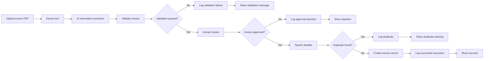

# Invoice Processing - Project 2, Part 2

Part 2 strengthens the invoice-processing workflow with explicit missing-field handling and persistent execution logs in Airtable. It retains the human approval and duplicate-prevention controls built in Part 1.

## Business purpose

Automated invoice processing needs an audit trail as well as successful data entry. This version records why an invoice stopped, who or what decision route it followed, and whether a record was created.

## Workflow architecture



## Enhancements in Part 2

### Missing-field detection

The validation node checks these required fields:

- Supplier
- Invoice number
- Invoice date
- Subtotal
- VAT
- Total
- Currency
- Payment deadline

Undefined values, null values, and blank strings are treated as missing. Missing fields are added to `validation_issues`, the validation result becomes false, and the invoice stops before manual review.

### Duplicate-invoice detection

Approved invoices are searched in Airtable using the supplier and invoice-number combination. Existing matches follow the duplicate route and never reach the invoice-creation node.

### Manual-review route

Valid invoices display their extracted values in an n8n review form:

- **Approve** continues to duplicate detection.
- **Reject** creates a failed log and ends with a rejection message.

### Persistent execution logs

The workflow writes audit records to the Airtable **Execution Logs** table.

| Field | Purpose |
|---|---|
| Execution ID | Identifies the n8n execution |
| Outcome | `Successful` or `Failed` |
| Timestamp | Date and time of the logged event |
| Status | Airtable status, set to `DONE` |
| Invoice Number | Extracted invoice identifier |
| Supplier | Extracted supplier name |
| Details | Explanation of the outcome |

Four Airtable nodes record the principal outcomes:

| Logging node | Outcome | Details |
|---|---|---|
| Log Successful Execution | Successful | Invoice saved to Airtable |
| Log Validation Failure | Failed | Specific validation issue |
| Log Approval Rejection | Failed | Invoice rejected during manual review |
| Log Duplicate Invoice | Failed | Duplicate found; no record created |

**Typecast** is enabled on every Airtable node that creates an invoice or execution-log record. It is not required on the search-only node.

## Key expressions

Execution ID:

```javascript
{{ $execution.id }}
```

Log timestamp:

```javascript
{{ $now.toISO() }}
```

Invoice number from the validated item:

```javascript
{{ $('Validate Invoice').item.json.invoice_number || 'Unknown' }}
```

Supplier from the validated item:

```javascript
{{ $('Validate Invoice').item.json.supplier || 'Unknown' }}
```

The validation-failure completion page references the validation node directly so its message remains available after the Airtable logging node:

```javascript
{{ $('Validate Invoice').item.json.validation_issues }}
```

## Tests completed

| Test | Expected result | Result |
|---|---|---|
| Temporarily blank the currency value | Missing-field error and failed log | Passed |
| Reject a valid invoice | Rejection message, failed log, no invoice record | Passed |
| Approve an existing invoice | Duplicate message, failed log, no new invoice record | Passed |
| Approve an invoice with a temporary unique number | Invoice record and successful log created | Passed |

All temporary test overrides were removed after testing.

## Files

- `workflow.json` — sanitized n8n workflow export
- `screenshots/workflow-overview.png` — final workflow canvas
- `screenshots/execution-logs.png` — Airtable execution-log evidence

## Security and limitations

- The published workflow export excludes pinned test data and credential references.
- No API keys, access-token values, or invoice files are included.
- The screenshots should contain only fictional training data.
- Search-before-create reduces duplicate risk but is not a database-level uniqueness constraint.
- A platform-level failure inside Airtable itself may require a separate n8n error workflow because the normal route cannot log after an unrecovered node failure.

## Skills demonstrated

- Defensive missing-field validation
- Human-in-the-loop approval
- Duplicate prevention
- Outcome-specific routing
- Persistent success and failure logs
- Airtable field mapping and type conversion
- End-to-end test design

