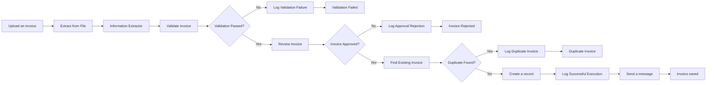
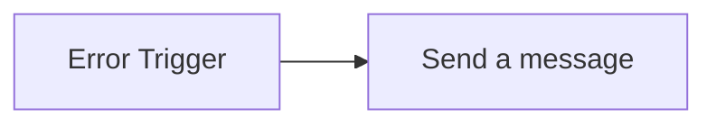

# Invoice Processing - Production Improvements

Day 19 upgrades the invoice-processing workflow with production-focused reliability, monitoring, and test coverage. It adds retry handling for temporary service failures, email notifications for successful and failed executions, and controlled tests for invalid, incomplete, and duplicate documents.

## Business purpose

A workflow is not production-ready merely because its successful route works. It must also recover from temporary service problems, alert the operator when processing fails, reject unsuitable documents safely, and prevent duplicate records.

These improvements make the invoice workflow easier to monitor, troubleshoot, and operate reliably.

## Workflow architecture

### Invoice-processing workflow



### Failure-notification workflow



The separate failure-notification workflow is named:

`Invoice Processing - Failure Notification`

It is configured as the Error Workflow for:

`Invoice Processing — Test Upload`

## Production improvements

### Retry handling

Retry handling was enabled only on nodes that depend on external services and may fail temporarily.

| Node or service | Maximum tries | Wait between tries |
|---|---:|---:|
| Information Extractor / OpenAI | 3 | 3000 ms |
| Find Existing Invoice | 3 | 2000 ms |
| Create a record | 3 | 2000 ms |
| Log Validation Failure | 3 | 2000 ms |
| Log Approval Rejection | 3 | 2000 ms |
| Log Duplicate Invoice | 3 | 2000 ms |
| Log Successful Execution | 3 | 2000 ms |

Retries are intended for temporary network, timeout, rate-limit, or service-availability failures.

Invalid or incomplete invoice content is handled by validation and is not retried.

### Success notifications

A Gmail notification is sent after an approved, non-duplicate invoice has been saved and its successful execution has been logged.

The successful route is:

`Create a record → Log Successful Execution → Send a message → Invoice saved`

The email includes:

- Invoice number
- Supplier
- Total amount

This route was tested with a valid invoice using the unique invoice number:

`N8N-20260907-7F3C9A`

The Airtable invoice record, execution log, Gmail notification, and final success page were all completed successfully.

### Failure notifications

Unexpected technical failures are handled by the separate workflow:

`Invoice Processing - Failure Notification`

Its route is:

`Error Trigger → Send a message`

If `Invoice Processing — Test Upload` still fails after its retry attempts, Gmail sends an alert containing:

- Workflow name
- Failed node
- Error message
- Link to the failed execution

The notification was tested through a published production execution using a temporary `Stop And Error` node with this message:

`DAY 19 TEST - Deliberate failure notification test`

The production execution failed as intended. The Gmail alert correctly identified:

- Workflow: `Invoice Processing — Test Upload`
- Failed node: `Stop And Error`
- Error: `DAY 19 TEST - Deliberate failure notification test`

The temporary test node was removed afterward, and the normal connection was restored:

`Upload an invoice → Extract from File`

## Validation and test coverage

### Incorrect-document test

A machine-readable meeting-notes PDF was submitted instead of an invoice.

Expected behaviour:

- Reject the document before human review
- Follow the false validation branch
- Log the validation failure in Airtable
- Create no invoice record
- Send no success notification

Actual route:

`Upload an invoice → Extract from File → Information Extractor → Validate Invoice → Validation Passed? → Log Validation Failure → Validation Failed`

The validator reported that all required invoice fields were missing.

The Airtable execution log recorded:

- Outcome: `failed`
- Status: `Done`
- Invoice Number: `Unknown`
- Supplier: `Unknown`
- Validation details listing the missing fields

Result: **Passed**

### Missing-information test

A valid-looking invoice was created with every required field except the payment deadline.

Test invoice number:

`N8N-MISSING-20260907-3C8D`

Expected behaviour:

- Extract the available invoice information
- Identify only the missing payment deadline
- Stop before human review
- Log the validation failure
- Create no invoice record

The validator returned:

```text
payment_deadline is missing
```

The supplier, invoice number, invoice date, subtotal, VAT, total, and currency were extracted successfully.

Result: **Passed**

### Duplicate-invoice test

An invoice already present in Airtable was approved and submitted.

Expected behaviour:

- Find the existing supplier and invoice-number combination
- Follow the duplicate branch
- Log the duplicate attempt
- Create no additional invoice record

Actual route:

`Find Existing Invoice → Duplicate Found? → Log Duplicate Invoice → Duplicate Invoice`

Result: **Passed**

### Successful-processing test

A valid invoice with a unique invoice number was approved and submitted.

Expected behaviour:

- Pass validation
- Receive human approval
- Find no duplicate
- Create the Airtable invoice record
- Log the successful execution
- Send the Gmail success notification
- Display the final success page

Actual route:

`Invoice Approved? → Find Existing Invoice → Duplicate Found? → Create a record → Log Successful Execution → Send a message → Invoice saved`

Result: **Passed**

### Technical-failure test

A temporary `Stop And Error` node deliberately caused a published production execution to fail.

Expected behaviour:

- Mark the main execution as failed
- Start `Invoice Processing - Failure Notification`
- Send a Gmail alert containing the failure details

The failure notification executed successfully and delivered the expected email.

Result: **Passed**

## Test summary

| Test | Expected result | Result |
|---|---|---|
| Valid invoice with a unique invoice number | Create invoice record, log success, send Gmail notification, and show success page | Passed |
| Existing invoice | Follow duplicate route, log the duplicate, and create no new invoice record | Passed |
| Non-invoice PDF | Fail validation, create a failure log, and show the correction message | Passed |
| Invoice missing its payment deadline | Report only the missing deadline and stop before review | Passed |
| Deliberate technical failure | Stop execution and send a detailed Gmail failure alert | Passed |

No test invoice reached `Create a record` unless it was valid, approved, and not already present in Airtable.
## Evidence

### Final production workflow


### Successful invoice execution


### Failure-notification workflow


### Deliberate technical failure


### Gmail failure notification


### Incorrect-document validation


### Missing payment deadline


## Problem, diagnosis, and solution

### Problem

`Invoice Processing - Failure Notification` initially appeared disabled in the Error Workflow selector.

After it became selectable, the setting repeatedly returned to:

`- No Workflow -`

As a result, failures in `Invoice Processing — Test Upload` did not start the notification workflow.

### Diagnosis

Two separate conditions were identified:

1. `Invoice Processing - Failure Notification` had to be published before the current n8n interface allowed it to be selected.
2. Saving the Workflow Settings window did not mark `Invoice Processing — Test Upload` as changed.

The main workflow failure itself was working correctly. The production execution stopped at `Stop And Error`, but no corresponding execution appeared under `Invoice Processing - Failure Notification`.

This isolated the problem to the saved workflow association rather than the Error Trigger or Gmail configuration.

### Solution

1. Publish `Invoice Processing - Failure Notification`.
2. Select it as the Error Workflow for `Invoice Processing — Test Upload`.
3. Save the Workflow Settings window.
4. Move a canvas node slightly so n8n registers a workflow change.
5. Save and publish `Invoice Processing — Test Upload`.
6. Reopen Workflow Settings and confirm that the selected Error Workflow remains saved.
7. Repeat the production failure test.

After this sequence, the failure-notification workflow executed successfully and sent the expected Gmail alert.

This behaviour is consistent with a reported n8n workflow-settings persistence issue:

https://github.com/n8n-io/n8n/issues/25359

## Security and limitations

- The repository must not contain API keys, access tokens, or working credential identifiers.
- Invoice and company details used during testing are fictional.
- Test PDFs should not be committed unless they contain only fictional data.
- Gmail addresses should be removed or obscured in public screenshots.
- The failure email’s execution link uses `localhost:5678`, so it is accessible only from the computer hosting the local n8n instance.
- Retry handling reduces temporary failures but cannot recover from every outage.
- Retrying record-creation operations may create duplicate records if an external service completes the request but loses the response.
- Search-before-create reduces duplicate risk but is not a database-level uniqueness constraint.
- Image-only PDFs still require a separate OCR or vision-processing route.

## Files

- `README.md` — Day 19 implementation notes and test results
- `workflow.json` — sanitized export of `Invoice Processing — Test Upload`
- `failure-notification-workflow.json` — sanitized export of `Invoice Processing - Failure Notification`
- `screenshots/` — workflow and execution evidence

## Skills demonstrated

- Production workflow hardening
- Retry strategy for external services
- Success and failure notifications
- n8n Error Trigger workflows
- Production execution testing
- Structured invoice validation
- Invalid-document rejection
- Missing-field detection
- Duplicate prevention
- Airtable audit logging
- Root-cause isolation
- Problem, diagnosis, and solution documentation