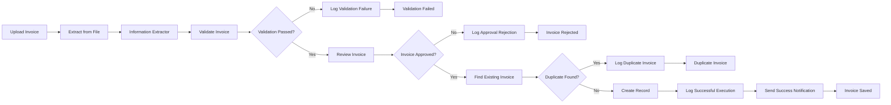
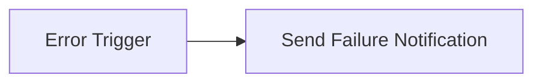

# Intelligent Invoice Processing Automation

An n8n-based invoice processing workflow that extracts invoice data, validates required fields, supports human approval, prevents duplicate records, logs outcomes in Airtable, and sends success or failure notifications.

## What It Solves

Manual invoice handling is repetitive and error-prone.

This workflow automates the invoice-processing path while keeping validation, duplicate checking, human approval, audit logging, and failure handling under control.

## Key Features

- PDF invoice data extraction
- Required-field validation
- Human approval step
- Duplicate invoice detection
- Airtable record creation and audit logging
- Retry handling for temporary service failures
- Gmail success notifications
- Dedicated failure notification workflow
- Tests for invalid, incomplete, duplicate, and successful invoices

## Tech Stack

- n8n
- OpenAI
- Airtable
- Gmail
- PDF data extraction
- Webhooks
- Conditional routing
- Error workflows
- Retry handling

## Workflow Architecture

### Main Invoice Workflow

### Failure Notification Workflow

A separate n8n workflow handles unexpected technical failures and sends a Gmail alert.

## Reliability Features

Retry handling is enabled on external-service nodes that may fail temporarily.

Examples include:

- OpenAI information extraction
- Airtable searches
- Airtable record creation
- Audit-log creation

Retries help handle temporary problems such as:

- network failures
- timeouts
- temporary API failures
- service availability issues

Invalid or incomplete invoice data is handled through validation rather than retries.

## Success Notifications

A Gmail notification is sent after a valid, approved, non-duplicate invoice has been stored successfully.

The notification includes:

- invoice number
- supplier
- total amount

Successful route:

`Create Record → Log Successful Execution → Send Success Notification → Invoice Saved`

## Failure Notifications

Unexpected technical failures are handled by a separate workflow:

`Error Trigger → Send Failure Notification`

The alert can include:

- workflow name
- failed node
- error message
- execution information

The failure workflow was tested using a deliberate technical error.

## Validation and Test Coverage

### Incorrect Document Test

A non-invoice document is rejected before invoice creation.

**Result:** Passed

### Missing Information Test

An invoice with required information missing is rejected and logged.

**Result:** Passed

### Duplicate Invoice Test

An invoice already present in Airtable follows the duplicate route instead of creating another record.

**Result:** Passed

### Successful Invoice Test

A valid, approved, unique invoice is stored in Airtable and produces a success notification.

**Result:** Passed

### Technical Failure Test

A deliberate workflow failure triggers the separate failure-notification workflow.

**Result:** Passed

## Test Summary

| Test | Expected Result | Result |
|---|---|---|
| Valid unique invoice | Create record and send success notification | Passed |
| Duplicate invoice | Detect duplicate and create no new record | Passed |
| Non-invoice document | Reject and log validation failure | Passed |
| Missing required information | Reject before record creation | Passed |
| Technical workflow failure | Trigger failure notification | Passed |

No invoice reaches record creation unless it is valid, approved, and not already present in Airtable.

## Security and Limitations

- API keys and access tokens are not committed to the repository.
- Test invoice and company data are fictional.
- Sensitive information should be removed or obscured in public screenshots.
- Retry handling cannot recover from every external-service failure.
- Search-before-create reduces duplicate risk but is not equivalent to a database uniqueness constraint.
- Image-only PDFs may require OCR or vision processing.

## Project Files

- `README.md` — project documentation
- `workflow.json` — sanitized main n8n workflow
- `failure-notification-workflow.json` — failure notification workflow
- `sample-invoices/` — fictional test documents
- `screenshots/` — workflow and execution evidence

## Skills Demonstrated

- n8n workflow design
- AI-powered information extraction
- API integration
- Human approval workflows
- Conditional routing
- Input validation
- Duplicate prevention
- Airtable integration
- Retry handling
- Error workflows
- Success and failure notifications
- Production testing
- Troubleshooting
- Technical documentation