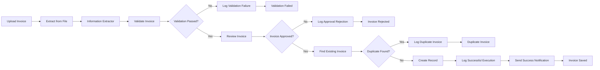
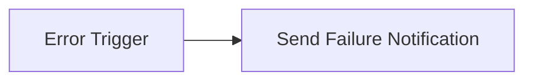
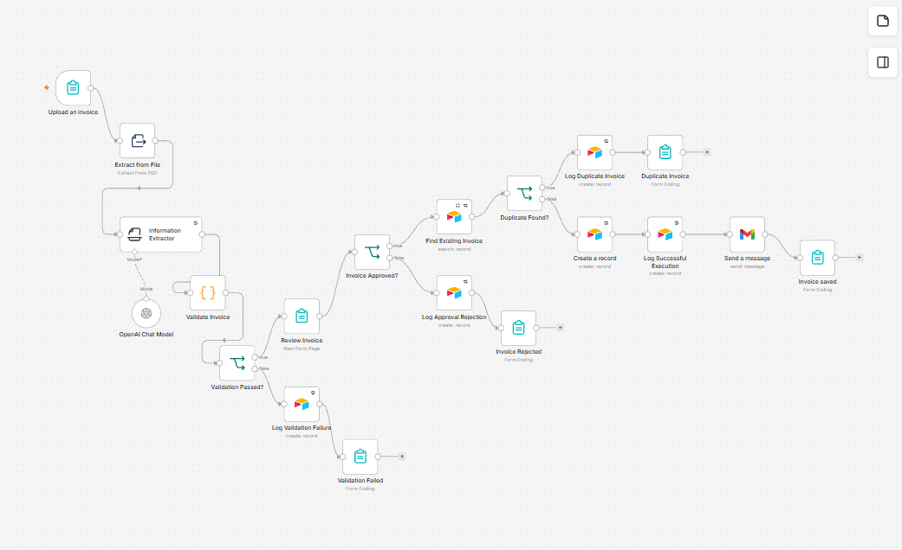
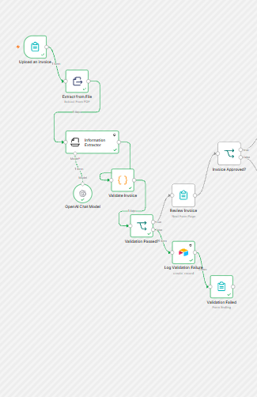
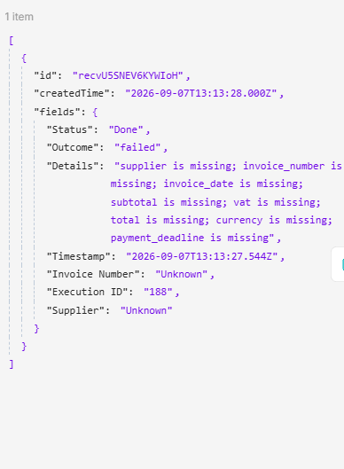
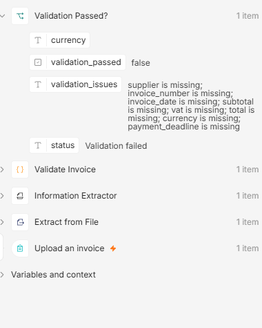
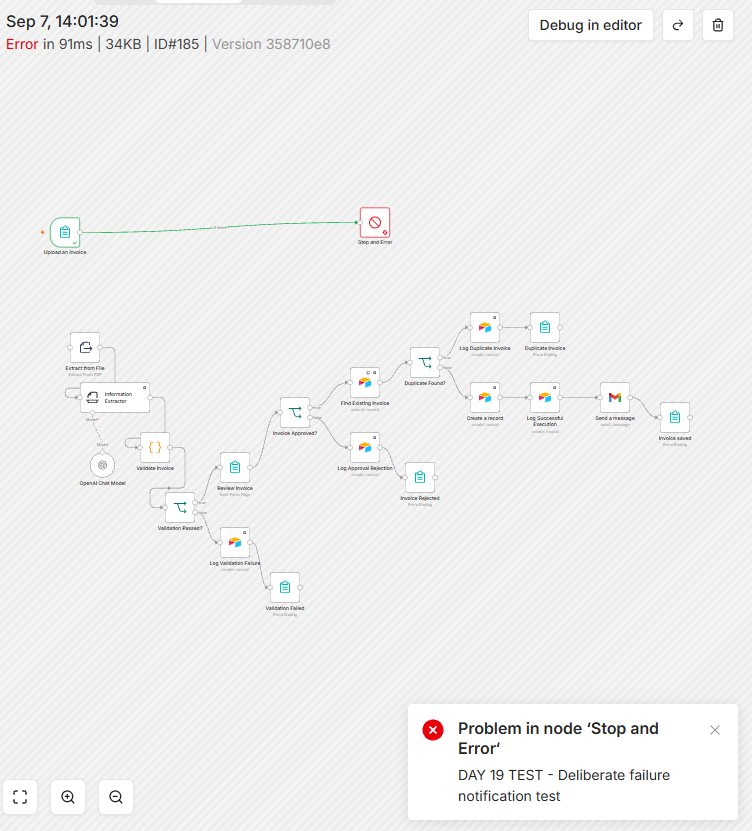
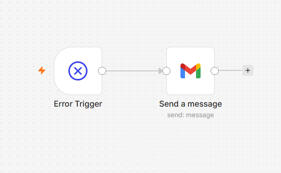
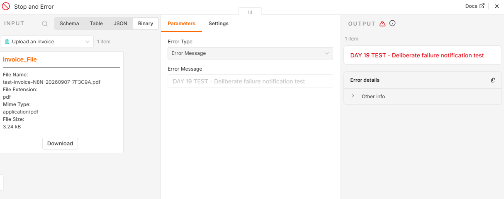

# Intelligent Invoice Processing Automation

An n8n-based invoice processing workflow that extracts invoice data, validates required fields, supports human approval, prevents duplicate records, logs outcomes in Airtable, and sends success or failure notifications.

## What It Solves

Manual invoice handling is repetitive and error-prone.

This workflow automates the invoice-processing path while keeping validation, duplicate checking, human approval, audit logging, and failure handling under control.

## Key Features

- PDF invoice data extraction
- Required-field validation
- Human approval step
- Duplicate invoice detection
- Airtable record creation and audit logging
- Retry handling for temporary service failures
- Gmail success notifications
- Dedicated failure notification workflow
- Tests for invalid, incomplete, duplicate, and successful invoices

## Tech Stack

- n8n
- OpenAI
- Airtable
- Gmail
- PDF data extraction
- Webhooks
- Conditional routing
- Error workflows
- Retry handling

## Workflow Architecture

### Main Invoice Workflow

### Failure Notification Workflow

A separate n8n workflow handles unexpected technical failures and sends a Gmail alert.

## Prerequisites

- A running n8n instance with form triggers available
- An OpenAI credential configured in n8n
- An Airtable personal access token with record read/write and schema-read access
- A Gmail OAuth credential for success and failure notifications
- An Airtable base with `Invoices` and `Execution Logs` tables

No working credential values are included in the exported workflow files.

## Airtable Schema

Create these fields before configuring the Airtable nodes:

### Invoices

| Field | Suggested type |
|---|---|
| Supplier | Single line text |
| Invoice Number | Single line text |
| Invoice Date | Date |
| Subtotal | Number |
| VAT | Number |
| Total | Number |
| Currency | Single line text |
| Payment Deadline | Date |
| Status | Single select or text |
| Validation Issues | Long text |
| Approved at | Date and time |

### Execution Logs

| Field | Suggested type |
|---|---|
| Execution ID | Single line text |
| Outcome | Single select or text |
| Timestamp | Date and time |
| Status | Single select or text |
| Invoice Number | Single line text |
| Supplier | Single line text |
| Details | Long text |

## Setup and Import

1. Download [`workflow.json`](workflow.json) and [`failure-notification-workflow.json`](failure-notification-workflow.json).
2. Import both JSON files into n8n using **Import from File**.
3. In the main workflow, select your OpenAI credential in **OpenAI Chat Model**.
4. Configure every Airtable node with your credential, base, and the appropriate `Invoices` or `Execution Logs` table.
5. Configure **Send a message** in the main workflow with your Gmail credential and notification recipient.
6. Configure **Send a message** in the failure workflow with your Gmail credential and failure-notification recipient.
7. Save and activate the failure-notification workflow.
8. Open the main workflow's settings and select the imported failure workflow as its error workflow.
9. Save the main workflow and open its test form.
10. Upload one of the fictional PDFs from [`sample-invoices`](sample-invoices/) and verify the resulting route.

Resource selections and recipient placeholders must be replaced after import. Do not publish credentials or real invoice data.

## Sample Test Data

The `sample-invoices` directory contains fictional documents for the principal routes:

- `sample-invoice.pdf` — valid invoice processing
- `test-invoice-N8N-20260907-7F3C9A.pdf` — duplicate or unique-record testing
- `test-invoice-missing-payment-deadline.pdf` — required-field validation
- `non-invoice-test-document.pdf` — incorrect-document validation

Use only fictional or appropriately anonymised documents when testing a public portfolio workflow.

## Reliability Features

Retry handling is enabled on external-service nodes that may fail temporarily.

Examples include:

- OpenAI information extraction
- Airtable searches
- Airtable record creation
- Audit-log creation

Retries help handle temporary problems such as:

- network failures
- timeouts
- temporary API failures
- service availability issues

Invalid or incomplete invoice data is handled through validation rather than retries.

## Success Notifications

A Gmail notification is sent after a valid, approved, non-duplicate invoice has been stored successfully.

The notification includes:

- invoice number
- supplier
- total amount

Successful route:

`Create Record → Log Successful Execution → Send Success Notification → Invoice Saved`

## Failure Notifications

Unexpected technical failures are handled by a separate workflow:

`Error Trigger → Send Failure Notification`

The alert can include:

- workflow name
- failed node
- error message
- execution information

The failure workflow was tested using a deliberate technical error.

## Validation and Test Coverage

### Incorrect Document Test

A non-invoice document is rejected before invoice creation.

**Result:** Passed

### Missing Information Test

An invoice with required information missing is rejected and logged.

**Result:** Passed

### Duplicate Invoice Test

An invoice already present in Airtable follows the duplicate route instead of creating another record.

**Result:** Passed

### Successful Invoice Test

A valid, approved, unique invoice is stored in Airtable and produces a success notification.

**Result:** Passed

### Technical Failure Test

A deliberate workflow failure triggers the separate failure-notification workflow.

**Result:** Passed

## Test Summary

| Test | Expected Result | Result |
|---|---|---|
| Valid unique invoice | Create record and send success notification | Passed |
| Duplicate invoice | Detect duplicate and create no new record | Passed |
| Non-invoice document | Reject and log validation failure | Passed |
| Missing required information | Reject before record creation | Passed |
| Technical workflow failure | Trigger failure notification | Passed |

No invoice reaches record creation unless it is valid, approved, and not already present in Airtable.

## Security and Limitations

- API keys and access tokens are not committed to the repository.
- Credentials should be stored only in n8n's encrypted credential store.
- OpenAI, Airtable, and Gmail credentials should receive only the permissions required by this workflow.
- Test invoice and company data are fictional.
- Sensitive information should be removed or obscured in public screenshots.
- Execution-history retention should be reviewed before processing real financial information.
- Retry handling cannot recover from every external-service failure.
- Search-before-create reduces duplicate risk but is not equivalent to a database uniqueness constraint.
- Image-only PDFs may require OCR or vision processing.

## Screenshots

### Main workflow

### Successful execution

### Incorrect-document validation

### Missing payment deadline

### Technical failure and notification

## Troubleshooting

### The form does not open

- Run the form trigger in test mode or activate the workflow before using its production URL.
- Confirm that the uploaded file is a PDF.

### OpenAI extraction fails

- Confirm that the OpenAI credential is valid and has available usage.
- Inspect the extracted text to confirm that the PDF is not image-only.
- Review the failed node's output in n8n's execution history.

### Airtable rejects a record

- Confirm that every node points to the correct base and table.
- Check that Airtable field names and types match the schema above.
- Confirm that the personal access token has the required scopes and base access.

### Notifications are not delivered

- Reconnect the Gmail OAuth credential.
- Confirm that both recipient placeholders were replaced.
- Verify that the failure workflow is active and selected in the main workflow's settings.

### A duplicate is created

- Confirm that **Find Existing Invoice** searches by both supplier and invoice number.
- For stronger production guarantees, add a database-level unique constraint or idempotency key.

## Project Files

- `README.md` — project documentation
- `workflow.json` — sanitized main n8n workflow
- `failure-notification-workflow.json` — failure notification workflow
- `sample-invoices/` — fictional test documents
- `screenshots/` — workflow and execution evidence

## Skills Demonstrated

- n8n workflow design
- AI-powered information extraction
- API integration
- Human approval workflows
- Conditional routing
- Input validation
- Duplicate prevention
- Airtable integration
- Retry handling
- Error workflows
- Success and failure notifications
- Production testing
- Troubleshooting
- Technical documentation
