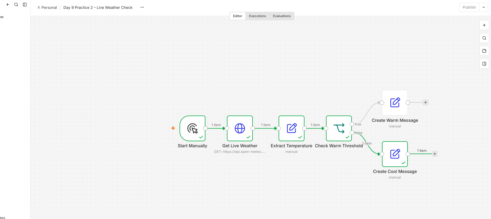

# Day 9 – Live Weather Check

## Overview
This n8n workflow retrieves live weather data for Las Palmas from the Open-Meteo API. It extracts the current temperature and compares it with a 25°C threshold. The workflow then produces either a warm-weather message or a cool-weather message.

## Workflow

Start Manually → Get Live Weather → Extract Temperature → Check Warm Threshold → Create Weather Message

## How It Works

1. Start Manually begins the workflow during testing.
2. Get Live Weather requests current weather data from Open-Meteo.
3. Extract Temperature maps the nested API value to a simpler temperature field.
4. Check Warm Threshold compares the temperature with 25°C.
5. The True or False branch creates the appropriate weather message.

## Workflow Screenshot

