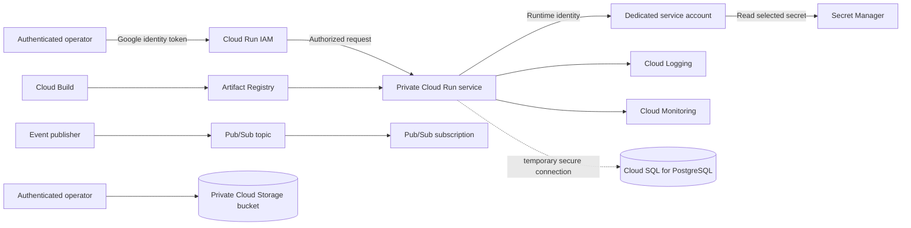

# Architecture

## Request path

1. A caller presents a Google identity token.
2. Cloud Run IAM rejects unauthenticated or unauthorized requests before they reach FastAPI.
3. FastAPI checks `x-api-key` on protected application endpoints.
4. Cloud Run obtains the API key from Secret Manager through the runtime service account.
5. During the controlled database exercise, Cloud Run connected to Cloud SQL through its managed Unix socket.
6. Logs and service metrics were collected automatically.

## Identity boundaries

- The operator's Google account manages the project and deployment.
- The Cloud Run service uses `stage5-fastapi-runtime`, not the operator's personal identity.
- The runtime identity can read only the secrets explicitly granted to it.
- Cloud SQL Client access was granted for the database exercise and removed after cleanup.

## Location choices

The workload used `europe-west1`. Keeping Cloud Run, Artifact Registry, Cloud Storage, and the temporary Cloud SQL instance in the same region reduces unnecessary latency, cross-region data movement, and operational complexity.
