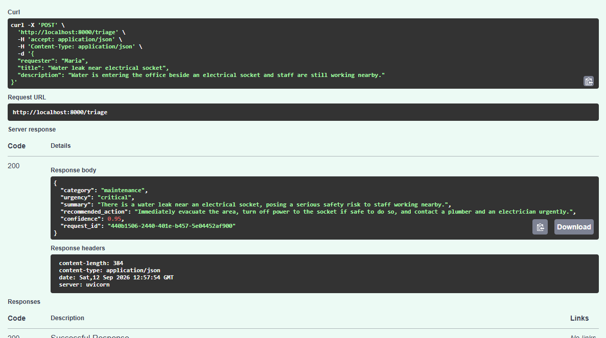

# OpsPilot AI

[](https://github.com/sousamaxfabio/automation-portfolio/actions/workflows/opspilot-ci.yml)

A containerised AI operations-triage environment combining n8n, Python, the OpenAI API, and a Python FastAPI service.

OpsPilot receives operational requests, validates their input, classifies their category and urgency, recommends an action, and returns a structured response.

## Demonstration



## What It Does

1. Receives an operations request through an n8n webhook.
2. Maps and validates the expected input fields.
3. Sends the request to a Python API over a private Docker network.
4. Uses the OpenAI Responses API to analyse the request.
5. Returns a structured category, urgency, summary, recommendation, confidence score, and request ID.
6. Preserves the n8n environment using a named Docker volume.

## Example Request

```json
{
  "requester": "Maria",
  "title": "Water leak near electrical socket",
  "description": "Water is entering the office beside an electrical socket and staff are still working nearby."
}
```

## Example Response

```json
{
  "category": "maintenance",
  "urgency": "critical",
  "summary": "A water leak is occurring near an electrical socket.",
  "recommended_action": "Isolate the area and contact emergency maintenance.",
  "confidence": 0.95,
  "request_id": "generated-request-id"
}
```

## Architecture

View the [architecture diagram](docs/architecture.md).

The environment contains:

- An n8n workflow exposed locally on port `5679`
- A FastAPI service exposed locally on port `8000`
- A private Docker network connecting the two services
- A persistent n8n data volume
- Runtime secrets supplied through a private `.env` file

Within the Docker network, n8n reaches the API at:

```text
http://ai-api:8000/triage
```

## Technology Stack

- Python 3.12
- FastAPI
- OpenAI Responses API
- n8n
- Docker
- Docker Compose
- GitHub Actions
- Python `unittest`

## Project Structure

```text
project-4-opspilot-ai/
├── docs/
│   └── architecture.md
├── n8n-workflow/
│   └── opspilot-triage-workflow.json
├── screenshots/
│   └── api-triage-success.png
├── tests/
│   └── test_app.py
├── .dockerignore
├── .env.example
├── app.py
├── compose.yaml
├── Dockerfile
├── README.md
└── requirements.txt
```

## Setup Instructions

### Prerequisites

- Docker Desktop
- Docker Compose
- An OpenAI API key

### 1. Create the private environment file

From the project folder:

```powershell
Copy-Item .env.example .env
```

Edit `.env` and replace the placeholder values:

```text
OPENAI_API_KEY=your_real_openai_api_key
OPENAI_MODEL=gpt-4o-mini
N8N_ENCRYPTION_KEY=your_long_random_private_value
```

Never commit or share `.env`.

### 2. Build and start the environment

```powershell
docker compose up -d --build
```

### 3. Check the services

FastAPI health check:

```text
http://localhost:8000/health
```

Interactive API documentation:

```text
http://localhost:8000/docs
```

Project 4 n8n instance:

```text
http://localhost:5679
```

### 4. Import the n8n workflow

In the Project 4 n8n instance:

1. Create a blank workflow.
2. Select **Import from File** or **Import from JSON**.
3. Choose `n8n-workflow/opspilot-triage-workflow.json`.
4. Keep the workflow unpublished until its nodes have been reviewed.
5. Publish it when ready to use the production webhook.

## Run Automated Tests

Create and use a virtual environment:

```powershell
python -m venv .venv
.\.venv\Scripts\python.exe -m pip install -r requirements.txt
.\.venv\Scripts\python.exe -m unittest discover -s tests -v
```

The tests validate:

- Health endpoint responses
- Input validation
- Missing API-key handling
- Structured AI response handling using a mocked OpenAI client

No real OpenAI request is made during automated tests.

## Useful Docker Commands

View service status:

```powershell
docker compose ps
```

View recent logs:

```powershell
docker compose logs --tail 30
```

Rebuild after a code change:

```powershell
docker compose up -d --build
```

Stop the environment without deleting its data:

```powershell
docker compose down
```

Do not add `-v` unless you intentionally want to delete the Project 4 n8n volume.

## Security

- `.env` is ignored by Git.
- `.env` is excluded from the Docker image.
- The OpenAI key is supplied only to the Python API container.
- The n8n encryption key is supplied only to the n8n container.
- Containers communicate through a private Docker network.
- The Python container runs as a non-root user.
- The API filesystem is read-only.
- Automated tests use fake credentials and make no external API calls.

## Troubleshooting

### Compose reports a missing variable

Confirm that `.env` exists beside `compose.yaml` and contains all three required variables.

### The API returns `503 AI service is not configured`

Confirm that `OPENAI_API_KEY` is set in the private `.env`, then recreate the API container:

```powershell
docker compose up -d --build
```

### The API returns `502 AI triage service failed`

Inspect the API logs:

```powershell
docker compose logs --tail 30 ai-api
```

Check the API key, model access, internet connection, and OpenAI API account status.

### n8n cannot connect to the AI service

Inside n8n, use the Docker service address:

```text
http://ai-api:8000/triage
```

Do not use `localhost:8000` from inside the n8n container.

### Port `8000` or `5679` is already in use

Stop the conflicting local service or change the host-side port in `compose.yaml`.

### Workflows disappear after restart

Confirm that the `opspilot_n8n_data` volume still exists:

```powershell
docker volume inspect opspilot_n8n_data
```

Avoid running `docker compose down -v`.

## CI Pipeline

GitHub Actions runs when Project 4 files change. It:

- Installs Python dependencies
- Checks Python syntax
- Runs four automated tests
- Validates the Compose configuration with fake CI values
- Verifies that the Docker image builds

## Verification Evidence

The repository includes a successful API-response screenshot, an exported n8n workflow, automated tests, and GitHub Actions validation for both Python and Docker.