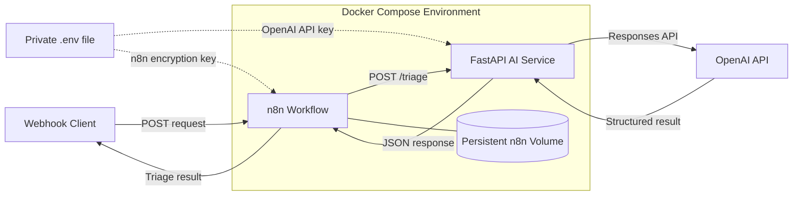

# OpsPilot AI Architecture

## Components

- **n8n:** Receives requests, maps input fields, calls the AI service, and returns results.
- **FastAPI service:** Validates requests and produces structured AI triage results.
- **OpenAI API:** Analyses each operational request.
- **Persistent volume:** Preserves the Project 4 n8n configuration.
- **Private Docker network:** Allows n8n to reach the API as `http://ai-api:8000`.
- **Environment file:** Supplies runtime secrets without storing them in the image or repository.