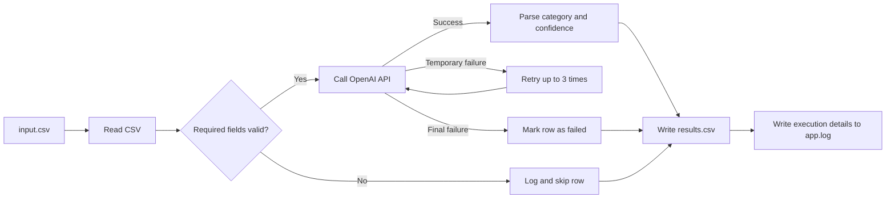
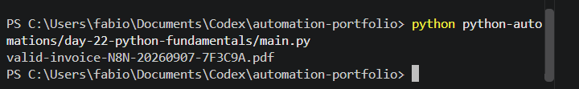
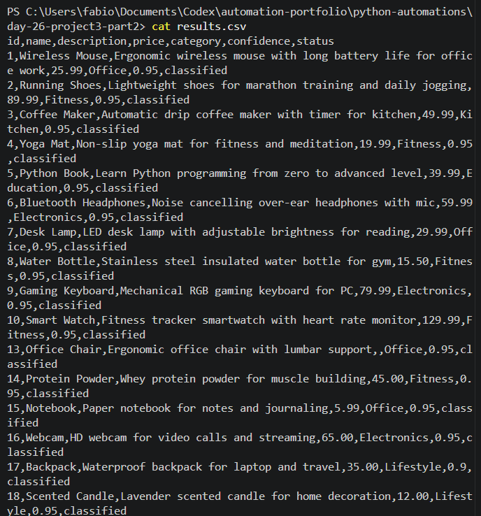

# AI CSV Classification Pipeline

A Python automation project that reads structured CSV data, validates required fields, classifies products using the OpenAI API, and writes the processed results to a new CSV file.

## What It Does

- Reads product data from `input.csv`
- Validates required fields before processing
- Sends valid records to the OpenAI API
- Classifies each product into a defined category
- Returns a confidence score
- Retries failed API requests up to 3 times
- Logs execution details to `app.log`
- Writes final results to `results.csv`

## Reliability Features

- Input validation
- Retry handling
- Exception handling
- Structured logging
- Environment variables for API credentials

## Tech Stack

- Python
- OpenAI API
- CSV
- `python-dotenv`
- Python logging
- Docker

## Architecture



The pipeline continues processing when an individual row is invalid or an API classification fails, preventing one bad record from stopping the entire batch.

## Project Files

- `main.py` — main automation pipeline
- `input.csv` — sample input data
- `results.csv` — processed output
- `requirements.txt` — Python dependencies
- `.env.example` — example environment configuration
- `screenshots/` — execution and output evidence
- `Dockerfile` — container build instructions
- `.dockerignore` — excludes secrets and unnecessary files from the image

## Example Result

The pipeline processes valid product records and returns:

- product category
- confidence score
- processing status

Invalid rows are skipped and logged instead of stopping the full workflow.

## Local Setup

1. Install Python 3.11 or later.
2. Open a terminal in this project directory.
3. Create a virtual environment:

```powershell
python -m venv .venv
```

4. Activate it in PowerShell:

```powershell
.\.venv\Scripts\Activate.ps1
```

5. Install the dependencies:

```powershell
python -m pip install -r requirements.txt
```

6. Copy `.env.example` to `.env` and replace the placeholder with your OpenAI API key:

```ini
OPENAI_API_KEY=your_openai_api_key
```

7. Run the pipeline:

```powershell
python main.py
```

The program reads `input.csv`, creates `results.csv`, and records detailed events in `app.log`.

## Sample Input and Output

Required input columns are `id`, `name`, and `description`. The optional `price` value is preserved in the output.

```csv
id,name,description,price
1,Wireless Mouse,Ergonomic wireless mouse for office work,25.99
2,Running Shoes,Lightweight shoes for marathon training,89.99
```

Example output:

```csv
id,name,description,price,category,confidence,status
1,Wireless Mouse,Ergonomic wireless mouse for office work,25.99,Office,0.95,classified
2,Running Shoes,Lightweight shoes for marathon training,89.99,Fitness,0.95,classified
```

The repository includes [`input.csv`](input.csv) and [`results.csv`](results.csv) as fictional sample data.

## Run the Tests

The automated tests cover valid and invalid rows plus CSV reading and writing:

```powershell
python -m unittest discover -s tests -v
```

The tests do not call the OpenAI API and therefore do not consume API usage.

## Error Handling

- A missing `.env` key stops execution with a clear configuration error.
- A missing or unreadable input file is logged without creating misleading results.
- Rows missing `id`, `name`, or `description` are logged and skipped.
- OpenAI failures are retried up to three times.
- A classification that still fails after the final attempt receives `category=Error`, `confidence=0.0`, and `status=failed`.
- Output-file errors are logged and reported in the terminal.

## Security Precautions

- `.env` is excluded by `.gitignore` and `.dockerignore`.
- The example environment file contains only a placeholder, never a key-shaped value.
- The API key is supplied at runtime and is not copied into the Docker image.
- Logs and screenshots should be reviewed before publication to ensure they contain no sensitive input or error details.
- Real personal or commercially sensitive product data should not be sent to an external AI service without authorisation.

## Screenshots

### Successful terminal execution



### Generated results



## Skills Demonstrated

- Python automation
- API integration
- Data validation
- Error handling
- Retry logic
- Logging
- Structured data processing
- Automated testing
- Docker containerisation
- Secure environment-variable configuration

## Docker

This project can run inside a Docker container while keeping the OpenAI API key outside the image.

### Build the Image

```powershell
docker build -t project3-classifier:v1 .
```

### Run Securely

Create a local `.env` file based on `.env.example`, then pass it to the container at runtime:

```powershell
docker run --name project3-test --env-file .env project3-classifier:v1
```

The `.dockerignore` file prevents `.env` and its API key from being copied into the image.

### Copy the Output

After the container finishes, copy the generated CSV to the current folder:

```powershell
docker cp project3-test:/app/results.csv docker-results.csv
```

### Remove the Test Container

```powershell
docker rm project3-test
```
