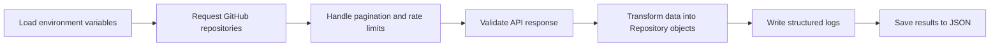

# GitHub Repository Monitor

A Python API integration that retrieves a user’s public GitHub repositories, validates and transforms the responses, reports repository status, and saves structured results to JSON.

This project demonstrates professional Python development, API engineering, automated testing, authentication, pagination, retries, logging, troubleshooting, and documentation.

## Features

- Connects to the GitHub REST API
- Supports optional bearer-token authentication
- Sends headers and query parameters
- Retrieves paginated results
- Uses request timeouts
- Retries temporary network and server failures
- Uses exponential backoff between retries
- Monitors GitHub API rate limits
- Handles 401, 403, 404 and other HTTP failures
- Validates API response structures
- Transforms API data into Python objects
- Saves processed results as JSON
- Produces structured console and file logs
- Includes automated unit tests
- Includes successful and unsuccessful Postman scenarios
- Includes example incident reports

## Project Structure

```text
github-repository-monitor/
├── app/
│   ├── api_client.py
│   ├── config.py
│   ├── exceptions.py
│   ├── http_client.py
│   ├── logging_config.py
│   ├── models.py
│   ├── storage.py
│   └── transformers.py
├── data/
│   ├── curl_repositories.json
│   └── repositories.json
├── docs/
│   └── openapi-notes.md
├── examples/
│   └── post_json_example.py
├── logs/
│   └── github_monitor.log
├── postman/
│   └── GitHub-Repository-Monitor.postman_collection.json
├── reports/
│   ├── incident-01-authentication-failure.md
│   ├── incident-02-user-not-found.md
│   └── incident-03-malformed-endpoint.md
├── tests/
│   ├── test_api_client.py
│   ├── test_http_client.py
│   ├── test_models.py
│   ├── test_storage.py
│   └── test_transformers.py
├── .env.example
├── .gitignore
├── main.py
├── requirements.txt
└── README.md
```

## Application Flow



## Requirements

- Python 3.14 or another compatible modern Python version
- A GitHub username
- An optional GitHub personal access token

A token increases the available GitHub API rate limit. Never commit a real token to Git.

## Installation

Clone the portfolio repository:

```powershell
git clone https://github.com/sousamaxfabio/automation-portfolio.git
cd automation-portfolio\python-automations\stage-1-professional-python\github-repository-monitor
```

Create a virtual environment:

```powershell
py -m venv .venv
```

Activate it:

```powershell
Set-ExecutionPolicy -Scope Process -ExecutionPolicy RemoteSigned
& ".\.venv\Scripts\Activate.ps1"
```

Install the dependencies:

```powershell
python -m pip install -r requirements.txt
```

## Configuration

Copy `.env.example` to `.env`:

```powershell
Copy-Item ".env.example" ".env"
```

Update `.env` with your own values:

```text
GITHUB_USERNAME=your_github_username
GITHUB_TOKEN=your_optional_github_token
```

The real `.env` file is excluded from Git by `.gitignore`.

## Running the Application

```powershell
python main.py
```

Example output:

```text
2026-09-17 10:32:55 | INFO | app.api_client | Authentication method: bearer token
2026-09-17 10:32:55 | INFO | app.api_client | Fetching repository page: 1
2026-09-17 10:32:55 | INFO | app.api_client | HTTP status: 200
2026-09-17 10:32:55 | INFO | app.api_client | Rate limit remaining: 4968/5000
2026-09-17 10:32:55 | INFO | __main__ | Repositories returned: 2
```

Processed repository information is written to:

```text
data/repositories.json
```

Application logs are written to:

```text
logs/github_monitor.log
```

## Automated Tests

Run the complete test suite:

```powershell
python -m pytest
```

Current result:

```text
13 passed
```

The tests cover:

- Repository models and status calculation
- API response transformation
- Missing-field validation
- JSON storage
- Successful API responses
- Pagination
- Invalid authentication
- Unknown GitHub users
- Rate-limit failures
- Network timeouts
- Retry behaviour
- Exponential backoff

The tests use simulated responses, so they do not consume GitHub API requests.

## Postman Collection

The exported collection is available at:

```text
postman/GitHub-Repository-Monitor.postman_collection.json
```

It includes:

- Successful repository retrieval
- Unknown-user 404 response
- Malformed-endpoint 404 response
- Automated status-code and response-body tests

The collection runner completed with four passing tests and no failures.

## JSON Request Body Example

The project also includes a POST request example:

```powershell
python examples\post_json_example.py
```

It sends a JSON request body to Postman Echo and validates that the returned JSON matches the submitted payload.

## API and OpenAPI Notes

The implementation follows the GitHub REST API documentation for:

```text
GET /users/{username}/repos
```

Notes about the endpoint, parameters, headers and responses are available in:

```text
docs/openapi-notes.md
```

## Error Handling

The application provides clear errors for:

- Invalid or expired authentication tokens
- Forbidden requests
- Exhausted rate limits
- Unknown GitHub users
- Malformed endpoints
- Connection failures
- Request timeouts
- Temporary server errors
- Unexpected response formats

Temporary failures are retried up to three times with exponential delays.

## Troubleshooting Evidence

Example incident reports are included for:

1. Authentication failure
2. GitHub user not found
3. Malformed API endpoint

They are stored in the `reports` folder and document the symptoms, root cause, investigation and resolution.

## Security

- Secrets are loaded from environment variables.
- The real `.env` file is ignored by Git.
- `.env.example` contains placeholders only.
- Tokens are never written to application logs.
- Authentication is optional for public GitHub repositories.

## Skills Demonstrated

- Professional Python project structure
- Object-oriented programming
- Type hints
- File and JSON handling
- Dependency and virtual-environment management
- REST API integration
- Headers, parameters and bearer tokens
- Pagination and rate-limit handling
- Timeouts, retries and exponential backoff
- Structured logging
- Automated testing with pytest
- Postman collection testing
- curl-based troubleshooting
- OpenAPI documentation analysis
- Technical incident reporting