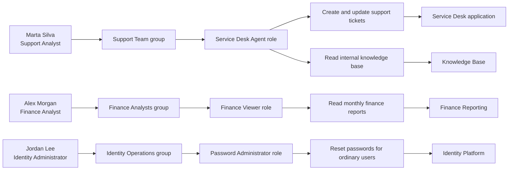
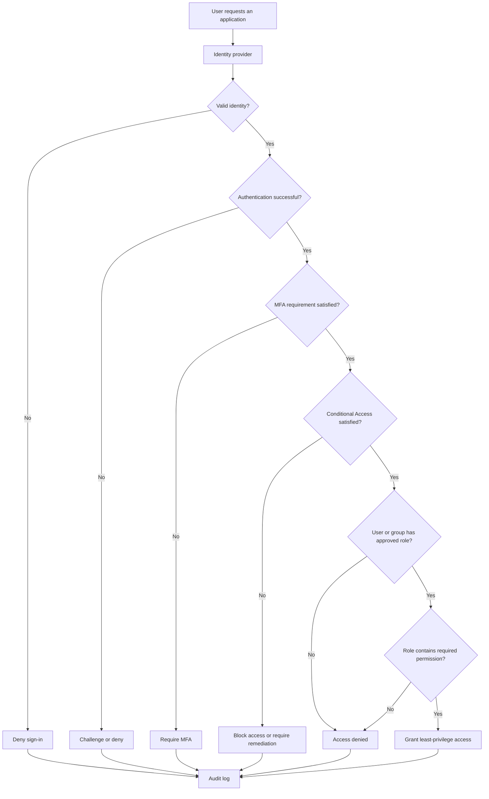

# IAM and RBAC Diagram

## Purpose

This document illustrates how Northstar Services manages fictional user identities and grants access through role-based access control.

Northstar Services is a fictional organisation. All identities, systems, roles and examples are fictional.

## IAM lifecycle

```mermaid
flowchart LR
    A[Approved joiner request] --> B[Create user identity]
    B --> C[Configure authentication]
    C --> D[Register MFA or passwordless method]
    D --> E[Assign licences]
    E --> F[Add approved groups]
    F --> G[Assign application roles]
    G --> H[Verify required access]
    H --> I[Record changes and approvals]
    I --> J[Periodic access review]

    J --> K{Employment change?}
    K -->|No| J
    K -->|Role change| L[Mover process]
    K -->|Departure| M[Leaver process]

    L --> N[Remove old-role access]
    N --> O[Add approved new-role access]
    O --> H

    M --> P[Block sign-in]
    P --> Q[Revoke active sessions and tokens]
    Q --> R[Remove groups and roles]
    R --> S[Preserve or transfer business data]
    S --> T[Recover licences and devices]
    T --> U[Delete identity according to retention policy]
```



## RBAC access model



## Authentication and access decision



## Access relationship

The preferred relationship is:

```text
User → Group → Role → Permission → Resource
```

Example:

```text
Marta Silva
→ Support Team
→ Service Desk Agent
→ Create and update support tickets
→ Service Desk application
```

Permissions should not normally be assigned directly to individual users because direct assignments are harder to review, explain and remove.

## Fictional role matrix

| Role | Read | Modify | Delete | Manage permissions | Intended user |
|---|---:|---:|---:|---:|---|
| Knowledge Base Reader | Yes | No | No | No | All employees |
| Service Desk Agent | Yes | Yes | No | No | Support staff |
| Finance Viewer | Yes | No | No | No | Finance analysts |
| Finance Editor | Yes | Yes | No | No | Approved finance staff |
| Password Administrator | Limited | Limited | No | Password resets only | Identity support |
| Global Administrator | Yes | Yes | Yes | Yes | Restricted emergency administration |

## IAM responsibilities

Identity and Access Management includes:

- Creating identities
- Updating identity attributes
- Enforcing authentication requirements
- Registering MFA or passwordless methods
- Assigning licences
- Managing group membership
- Managing roles
- Managing SSO and federation
- Reviewing access
- Revoking sessions and tokens
- Disabling accounts
- Preserving audit evidence
- Deleting identities according to policy

## RBAC responsibilities

Role-Based Access Control includes:

- Defining roles around job responsibilities
- Assigning permissions to roles
- Assigning users to groups
- Assigning groups to roles
- Separating ordinary and privileged access
- Reviewing role membership
- Removing obsolete access
- Preventing excessive direct permission assignments

## Least-privilege controls

Northstar Services applies the following controls:

- Use read-only access when modification is not required.
- Assign users through approved groups.
- Use limited administrator roles instead of global administration.
- Use separate accounts for privileged administration.
- Require MFA for privileged roles.
- Make temporary access expire automatically.
- Review privileged access regularly.
- Remove old access during role changes.
- Revoke access promptly during offboarding.
- Record approvals and administrative changes.
- Never store passwords, tokens or recovery codes in tickets.

## Access-denied interpretation

An access-denied message after successful sign-in normally indicates an authorization problem, such as:

- Missing group membership
- Missing role assignment
- Incorrect application assignment
- Insufficient permission in the assigned role
- Conditional Access failure
- Device-compliance failure
- Expired temporary access
- Access inherited from or blocked by another policy
- Delay while directory or application changes propagate

Authentication should be investigated separately when the user cannot prove their identity or complete sign-in.