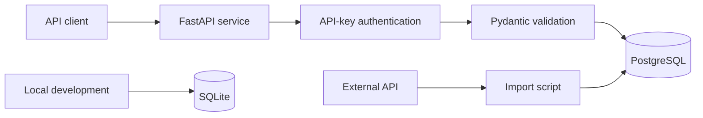

# Stage 2 SQL and FastAPI Service

A containerised FastAPI service demonstrating SQL, PostgreSQL, SQLite, request validation, API-key authentication, automated testing, external API integration, and Docker packaging.

## Project Outcomes

This project demonstrates:

- SQL queries and relational database design
- Local development with SQLite
- Deployment-oriented storage with PostgreSQL
- FastAPI GET and POST endpoints
- Pydantic request validation
- API-key authentication
- Health and readiness checks
- Application-level error handling
- Automated endpoint testing
- Mocked external API calls
- Test coverage measurement
- Docker packaging

## Technology Stack

- Python 3.14
- FastAPI
- Pydantic
- PostgreSQL
- SQLite
- psycopg
- HTTPX
- pytest
- pytest-cov
- Docker

## Project Structure

```text
stage2-api-service/
├── .dockerignore
├── .env.example
├── .gitignore
├── database.py
├── Dockerfile
├── external_service.py
├── fetch_and_store.py
├── main.py
├── README.md
├── requirements.txt
├── schema.sql
├── sql_practice.sql
├── sqlite_setup.py
├── test_external_service.py
└── test_main.py
```

Local `.env`, `.coverage`, cache, and database files are excluded from Git.

## Architecture



## Database Structure

### `customers`

| Column | Purpose |
|---|---|
| `id` | Primary key |
| `name` | Customer name |

### `requests`

| Column | Purpose |
|---|---|
| `id` | Primary key |
| `customer_id` | Foreign key referencing `customers.id` |
| `category` | Request category |
| `priority` | `low`, `medium`, or `high` |

Relationship:

```text
customers (1) ──────── (*) requests
```

One customer can have multiple requests. Every request must reference an existing customer.

The PostgreSQL structure is defined in `schema.sql`.

## SQL Evidence

`sql_practice.sql` demonstrates:

- `SELECT`
- `WHERE`
- `ORDER BY`
- `LIMIT`
- `INSERT`
- `UPDATE`
- `DELETE`
- `COUNT`
- `GROUP BY`
- `INNER JOIN`
- `LEFT JOIN`
- Primary and foreign keys
- Relationship investigation
- Invalid-data investigation
- Transactions
- `ROLLBACK`
- Parameterised-query patterns
- Basic indexing

The demonstrated `UPDATE` and `DELETE` operations use transactions followed by `ROLLBACK`, so they do not permanently modify the sample data.

## SQLite Local Development

Python includes SQLite without requiring a separate database server.

Create the local database and safe sample data:

```powershell
python sqlite_setup.py
```

Expected output:

```text
(1, 'Example Company', 'billing', 'high')
(2, 'Sample Customer', 'technical', 'medium')
SQLite database ready: stage2_local.db
```

The generated `.db` file is ignored by Git.

## PostgreSQL Setup

Create a PostgreSQL database for the project, then apply the schema:

```powershell
psql -U postgres -d stage2_service -f schema.sql
```

If `psql` is not on the Windows command path, use its complete path. For example:

```powershell
& "C:\Program Files\PostgreSQL\18\bin\psql.exe" `
    -U postgres `
    -d stage2_service `
    -f ".\schema.sql"
```

## Installation

Create and activate a virtual environment:

```powershell
py -m venv .venv
Set-ExecutionPolicy -Scope Process -ExecutionPolicy RemoteSigned
& ".\.venv\Scripts\Activate.ps1"
```

Install the dependencies:

```powershell
python -m pip install -r requirements.txt
```

## Configuration

Copy the safe template:

```powershell
Copy-Item ".env.example" ".env"
```

Update `.env` with your local values:

```dotenv
DB_NAME=stage2_service
DB_USER=postgres
DB_PASSWORD=your_private_database_password
DB_HOST=localhost
DB_PORT=5432
API_KEY=your_private_api_key
```

Never commit `.env` or real credentials.

## Running the API

Start the development server:

```powershell
uvicorn main:app --reload --port 8001
```

Useful URLs:

- Health: `http://127.0.0.1:8001/health`
- Readiness: `http://127.0.0.1:8001/readiness`
- Swagger UI: `http://127.0.0.1:8001/docs`
- ReDoc: `http://127.0.0.1:8001/redoc`

FastAPI generates the OpenAPI specification automatically.

## API Endpoints

### Health

```http
GET /health
```

Response:

```json
{
  "status": "ok"
}
```

### Readiness

```http
GET /readiness
```

Successful response:

```json
{
  "status": "ready",
  "database": "connected"
}
```

The endpoint returns `503 Service Unavailable` when PostgreSQL cannot be reached.

### List Requests

```http
GET /requests
x-api-key: your_private_api_key
```

Example response:

```json
[
  {
    "id": 1,
    "customer": "Example Company",
    "category": "billing",
    "priority": "high"
  }
]
```

### Create Request

```http
POST /requests
Content-Type: application/json
x-api-key: your_private_api_key
```

Example body:

```json
{
  "customer_id": 1,
  "category": "billing",
  "priority": "medium"
}
```

Successful creation returns `201 Created`.

The API also demonstrates:

- `401 Unauthorized` for an invalid API key
- `404 Not Found` for an unknown customer
- `422 Unprocessable Entity` for invalid request data
- `500 Internal Server Error` for an unexpected database failure
- `503 Service Unavailable` when the readiness check cannot reach PostgreSQL

## Authentication

Protected endpoints require an `x-api-key` header.

API-key authentication is suitable for this controlled portfolio demonstration. Larger user-facing systems commonly use OAuth 2.0 for delegated authorisation and JWTs for signed identity or access claims.

Secrets are loaded from environment variables and are never stored in the source code.

## External API Integration

`fetch_and_store.py` retrieves JSON from an external API and stores transformed fields in PostgreSQL:

```powershell
python fetch_and_store.py
```

`external_service.py` provides a separate integration that is tested with a mocked HTTP response. The automated test does not make a real network request.

## Automated Testing

Run all tests:

```powershell
python -m pytest
```

Measure useful application coverage:

```powershell
python -m pytest `
    --cov=main `
    --cov=external_service `
    --cov-report=term-missing
```

Verified result:

```text
10 passed
TOTAL 96% coverage
```

Tests cover:

- Health responses
- Successful readiness checks
- Database readiness failures
- Missing API keys
- Invalid API keys
- Successful authenticated requests
- Successful record creation
- Pydantic validation failures
- Unknown customers
- Mocked external API calls

## Docker

Build the image:

```powershell
docker build -t stage2-api-service:latest .
```

Run the API container:

```powershell
docker run --rm `
    --name stage2-api-service `
    -p 127.0.0.1:8001:8001 `
    --env-file .env `
    -e DB_HOST=host.docker.internal `
    stage2-api-service:latest
```

Test the container:

```powershell
Invoke-RestMethod "http://127.0.0.1:8001/health"
```

The Docker image and health endpoint were successfully verified.

## Security Practices

- Real secrets are stored only in `.env`.
- `.env` is excluded from Git and Docker.
- `.env.example` contains placeholders only.
- Local database files are ignored.
- SQL values are passed through parameterised queries.
- Pydantic validates incoming request data.
- Protected endpoints require an API key.
- Docker excludes caches, coverage files and local databases.
- Automated external-service tests use mocked responses.

## Evidence Produced

- PostgreSQL database integration
- SQLite local-development example
- Documented relational database structure
- Safe sample data
- SQL practice and investigation queries
- FastAPI service with generated OpenAPI documentation
- Environment-based configuration
- Basic API authentication
- Automated success and failure tests
- 96% useful application coverage
- External API results stored in PostgreSQL
- Successful Docker build and health check